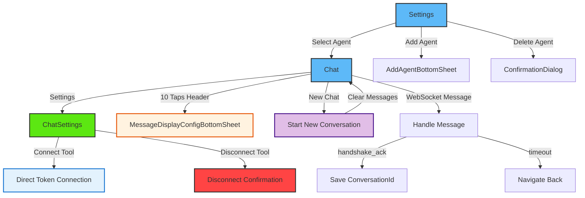

# Agent

<details>
<summary><strong>Overview</strong></summary>

The agent module provides comprehensive AI-powered chat functionality with device control capabilities. It enables users to interact with AI agents through WebSocket connections, manage agent configurations, connect external tools/connectors, and control smart home devices through natural language conversations. The module integrates with the ESP RainMaker MCP (Model Context Protocol) connector for device operations.

</details>


## Navigation Flow



The agent module flow consists of several main paths:

1. **Agent Management**: Settings → (Add/Select/Delete Agent)
2. **Chat Flow**: Settings → Chat → (Send Message → Receive Response)
3. **New Chat**: Chat → New Chat → (Start Fresh Conversation)
4. **Connector Management**: ChatSettings → (Connect/Disconnect Tool)


<details>
<summary><strong>Screens and Features</strong></summary>

### 1. Chat Screen (`Chat.tsx`)

- **Purpose**: Main AI chat interface with real-time WebSocket communication
- **Key Features**:
  - Real-time bidirectional WebSocket communication with AI agents
  - Message history management with windowing approach (max messages in memory)
  - Multiple message types: user, assistant, thinking, tool calls, tool results, usage info
  - Markdown rendering for assistant messages
  - JSON expandable viewer for tool results and metadata
  - Connection status indicator and reconnection handling
  - Conversation persistence with conversation ID management
  - Message display configuration (show/hide different message types)
  - Timeout handling with automatic navigation
  - New Chat functionality to start a fresh conversation
- **Initialization Flow**:
  1. Load agent configuration from API
  2. Check required connectors (especially Rainmaker MCP)
  3. Auto-connect Rainmaker MCP if missing (using tokens)
  4. Initialize WebSocket connection
  5. Load previous conversation messages if conversationId exists
  6. Send handshake message to establish conversation
- **Key Functions**:

  ```typescript
  // Get WebSocket URL with access token
  const url = await getWebSocketUrl(store);
  
  // Get agent configuration
  const config = await getAgentConfig(agentId);
  
  // Get connected connectors
  const connectors = await getConnectedConnectors();
  
  // Connect Rainmaker MCP with tokens
  await connectToolWithTokens(store, RAINMAKER_MCP_CONNECTOR_URL, metadata);
  ```

- **WebSocket Message Types**:
  - `user`: User message sent to agent
  - `assistant`: Agent response message
  - `thinking`: Agent thinking process (can be hidden)
  - `tool_call_info`: Tool being called by agent
  - `tool_result_info`: Tool execution result (JSON expandable)
  - `usage_info`: Token usage information (JSON expandable)
  - `transaction_end`: End of agent processing
  - `handshake`: Initial connection handshake
  - `handshake_ack`: Handshake acknowledgment with conversationId
  - `timeout`: Session timeout notification

- **Message Display Configuration**:
  - Configurable visibility for each message type
  - Accessible via 10 taps on header title (hidden feature)
  - Stored in user custom data for persistence
  - Default: show user and assistant, hide others

### 2. Chat Settings Screen (`ChatSettings.tsx`)

- **Purpose**: Agent configuration and connector management
- **Key Features**:
  - Agent information display (ID, name, model IDs, conversation ID)
  - Connector/tool management with connection status
  - Token-based connector connection (for MCP)
  - connector status updates
  - Font size adjustment slider
- **Key Functions**:

  ```typescript
  // Get agent configuration
  const config = await getAgentConfig(agentId);
  
  // Get connected connectors
  const connectors = await getConnectedConnectors();
  
  // Connect connector with tokens (MCP)
  await connectToolWithTokens(store, connectorUrl, metadata);
  
  // Disconnect connector
  await disconnectConnector(connectorUrl);
  ```

- **Connector Connection Flow**:
  1. Check if connector requires token-based auth
  2. For Rainmaker MCP connector: Use direct token connection
  3. Update connector status in UI

### 3. Settings Screen (`Settings.tsx`)

- **Purpose**: Agent management - create, select, and delete agents
- **Key Features**:
  - List all configured agents with selection indicators
  - Attach new agents with name and agent ID
  - Select active agent for chat
  - Delete agents (except default, common or user agent)
  - Edit mode for bulk operations
  - Agent validation and aggregation from multiple sources
- **Key Functions**:

  ```typescript
  // Get all agents from storage (aggregated from all sources)
  const agents = await getAllAgents(store.userStore);
  
  // Save agents to storage
  await saveAgents(store.userStore, agents);
  
  // Get selected agent ID
  const selectedId = await getSelectedAgentId(store.userStore);
  
  // Save selected agent ID
  await saveSelectedAgent(store.userStore, agentId);
  
  // Validate agent input
  const isValid = validateAgentInput(name, agentId);
  
  // Check if agent can be deleted
  const canDelete = canDeleteAgentBySource(agent.source);
  ```

- **Agent Storage**:
  - Agents stored in user custom data with key `ai_agents`
  - Selected agent stored with key `selected_ai_agent`
  - Default agent always exists and cannot be deleted
  - Agent structure: `{ id, name, agentId, isDefault, source }`
  - Supports multiple agent sources: template, user, custom

### 4. Layout (`_layout.tsx`)

- **Purpose**: Navigation layout configuration for agent module
- **Key Features**:
  - Stack navigation with gesture support
  - Platform-specific animations (iOS/Android)
  - Header hidden (custom headers in screens)
  - Horizontal gesture navigation enabled

</details>

<details>
<summary><strong>Common Patterns</strong></summary>

1. **Store Access Pattern**:

   ```typescript
   const { store } = useCDF();
   const { userStore } = store;
   ```

2. **Agent Configuration Pattern**:

   ```typescript
   // Get selected agent ID
   const agentId = await getSelectedAgentId(store.userStore);
   
   // Get agent configuration from API
   const config = await getAgentConfig(agentId, store.userStore);
   
   // Validate agent ID
   if (!agentId || agentId.trim() === '') {
     throw new Error('Agent ID is required');
   }
   ```

3. **WebSocket Connection Pattern**:

   ```typescript
   // Get WebSocket URL with token
   const url = await getWebSocketUrl(store);
   
   // Create WebSocket connection
   const ws = new WebSocket(url);
   
   // Send handshake message
   ws.send(JSON.stringify({
     type: 'handshake',
     content_type: 'json',
     content: {
       conversationType: 'text',
       conversationId: storedConversationId // optional
     }
   }));
   
   // Handle messages
   ws.onmessage = (event) => {
     const message: WebSocketMessage = JSON.parse(event.data);
     handleWebSocketMessage(message);
   };
   ```

4. **Token-Based Connection Pattern** (for MCP):

   ```typescript
   // Get tokens from storage
   const accessToken = await AsyncStorage.getItem(TOKEN_STORAGE_KEYS.ACCESS_TOKEN);
   const refreshToken = await AsyncStorage.getItem(TOKEN_STORAGE_KEYS.REFRESH_TOKEN);
   
   // Decode JWT to get expiration
   const decodedToken = decodeJWT(accessToken);
   const expiresAt = decodedToken?.exp ? decodedToken.exp - 10 : undefined;
   
   // Connect with tokens
   await connectConnectorWithTokens({
     connectorUrl: RAINMAKER_MCP_CONNECTOR_URL,
     accessToken,
     refreshToken,
     expiresAt,
     tokenType: 'Bearer',
     scope: 'email',
     tokenEndpoint: metadata?.tokenEndpoint,
     clientId: metadata?.clientId,
     resource: metadata?.resource,
     authType: 'oauth',
   });
   ```

5. **Error Handling Pattern**:

   ```typescript
   try {
     const result = await operation();
     toast.showSuccess("Success message");
   } catch (error: any) {
     console.error("Operation failed:", error);
     toast.showError(
       "Error title",
       error.message || error.description || "Operation failed"
     );
   }
   ```

6. **Loading State Pattern**:

   ```typescript
   const [isLoading, setIsLoading] = useState(false);
   
   const handleOperation = async () => {
     setIsLoading(true);
     try {
       await operation();
     } catch (error) {
       // Handle error
     } finally {
       setIsLoading(false);
     }
   };
   ```

7. **Message Display Configuration Pattern**:

   ```typescript
   // Load configuration
   const config = await getMessageDisplayConfig();
   
   // Update configuration
   await saveMessageDisplayConfig({
     showUser: true,
     showAssistant: true,
     showThinking: false,
     showToolCallInfo: false,
     showToolResultInfo: false,
     showUsageInfo: false,
     showTransactionEnd: false,
     showHandshakeAck: false,
   });
   ```

8. **Conversation Management Pattern**:

   ```typescript
   // Save conversation ID from handshake_ack
   if (message.type === 'handshake_ack') {
     const conversationId = message.content?.conversationId;
     if (conversationId) {
       await saveConversationId(conversationId, store.userStore);
     }
   }
   
   // Load previous conversation
   const conversationId = await getConversationId(store.userStore);
   if (conversationId) {
     const conversation = await getConversationByAgent(agentId, conversationId);
     // Load messages from conversation
   }
   
   // Start new chat (clear conversation ID and messages)
   await deleteConversationId(store.userStore);
   clearMessages(); // Clear message history
   ```

9. **Agent Aggregation Pattern**:

    ```typescript
    // Get all agents from all sources (template, user, custom)
    const allAgents = await getAllAgents(store.userStore);
    
    // Validate agent before use
    const validation = validateAgent(agent);
    if (!validation.isValid) {
      // Handle invalid agent
    }
    
    // Remove invalid agents from storage
    await removeInvalidAgentFromCustomData(store.userStore, invalidAgentId);
    ```

</details>

## Code Structure

### Agent Helper Utilities (`utils/agent/`)

The agent utility module provides comprehensive utilities for agent management, WebSocket communication, and storage operations.

#### Storage Operations (`utils/agent/storage.ts`)

- **Agent Management**:
  - `getAgents(userStore)`: Get all configured agents from user custom data
  - `saveAgents(userStore, agents)`: Save agents configuration
  - `getSelectedAgentId(userStore)`: Get currently selected agent ID with validation
  - `saveSelectedAgent(userStore, agentId)`: Save selected agent ID
  - `hasAgentsConfigured(userStore)`: Check if any agents are configured
  - `getAgentsAndSelectedId(userStore)`: Get both agents and selected ID in one call

- **Message Display Configuration**:
  - `getMessageDisplayConfig()`: Get message display settings from AsyncStorage
  - `saveMessageDisplayConfig(config)`: Save message display settings

- **Conversation Management**:
  - `getConversationId(userStore)`: Get stored conversation ID from user custom data
  - `saveConversationId(id, userStore)`: Save conversation ID
  - `deleteConversationId(userStore)`: Delete conversation ID
  - `isConversationExpired(conversationId)`: Check if conversation has expired (4 hours)

- **Font Size Management**:
  - `getChatFontSize()`: Get saved font size from AsyncStorage
  - `saveChatFontSize(size)`: Save font size preference

#### API Operations (`utils/agent/api.ts`)

- **Agent Configuration**:
  - `getAgentConfig(agentId, userStore?)`: Fetch agent configuration from API
  - `getWebSocketUrl(store)`: Get WebSocket URL with access token
  - `getAgentConfigFromCache(agentId)`: Get cached agent config
  - `saveAgentConfigToCache(agentId, config)`: Cache agent config
  - `getAgentNameFromCache(agentId)`: Get cached agent name

- **Connection Status**:
  - `getToolConnectionStatus(toolUrl, connectors, expectedConnectorId?)`: Check connector connection status

#### Utility Functions (`utils/agent/device.ts`)

- **Device Detection**:
  - `isAIAssistantDevice(device)`: Check if device is an AI assistant device
  - `filterAIAssistantDevices(devices)`: Filter AI assistant devices from list
  - `getDeviceKey(nodeId, deviceName)`: Generate device key
  - `findAgentIdParam(device)`: Find agent ID parameter in device
  - `getCurrentAgentId(device)`: Get current agent ID from device
  - `updateRefreshTokensForAllAIDevices(store, refreshToken)`: Update refresh tokens for all AI devices
  - `setUserAuthForNode(store, nodeId, accessToken, refreshToken)`: Set user auth for node

#### Aggregation Functions (`utils/agent/aggregation.ts`)

- **Agent Aggregation**:
  - `getAllAgents(userStore)`: Get all agents from all sources (template, user, custom)
  - `validateAgent(agent)`: Validate agent configuration
  - `removeInvalidAgentFromCustomData(userStore, agentId)`: Remove invalid agent from storage
  - `canDeleteAgentBySource(source)`: Check if agent can be deleted based on source

#### Constants (`utils/agent/constants.ts`)

- `AGENT_STORAGE_KEYS`: AsyncStorage keys for agent data
- `CUSTOM_DATA_KEYS`: User custom data keys for agent configuration
- `CONVERSATION_EXPIRATION_MS`: Conversation expiration time (4 hours)
- `AI_ASSISTANT_TYPES`: Supported AI assistant device types
- `DEFAULT_FONT_SIZE`: Default chat font size
- `TOKEN_STORAGE_KEYS`: Token storage keys
- `AGENT_SOURCE`: Agent source types (template, user, custom)

## useAgent Hook (`hooks/useAgent.ts`)

The `useAgent` hook provides centralized state management for all agent-related operations.

### State Management

```typescript
{
  // Agent management
  agents: AgentConfig[];
  selectedAgentId: string;
  isLoadingAgents: boolean;
  
  // Agent config
  agentConfig: any;
  isLoadingConfig: boolean;
  configError: string | null;
  
  // Connectors
  connectors: ConnectedConnector[];
  isLoadingConnectors: boolean;
  connectingToolUrl: string | null;
  disconnectingToolUrl: string | null;
  
  // Message display config
  messageDisplayConfig: MessageDisplayConfig;
  
  // Conversation
  conversationId: string | null;
}
```

### Hook Functions

- **Agent Management**:
  - `fetchAgents()`: Load agents from storage, ensure default exists
  - `addAgent(name, agentId)`: Add new agent or update existing one
  - `selectAgent(agent)`: Set agent as active
  - `deleteAgent(agent)`: Delete agent (except default)

- **Agent Configuration**:
  - `loadAgentConfig(agentId?)`: Load agent config from API
  - `getWebSocketUrlForAgent()`: Get WebSocket URL

- **Connectors**:
  - `loadConnectors()`: Load connected connectors
  - `getToolConnectionStatus(toolUrl)`: Check connection status
  - `connectToolWithTokensDirect(toolUrl, metadata)`: Connect with tokens
  - `disconnectTool(toolUrl)`: Disconnect connector

- **Message Display Config**:
  - `loadMessageDisplayConfig()`: Load configuration
  - `updateMessageDisplayConfig(config)`: Update configuration

- **Conversation**:
  - `loadConversationId()`: Load conversation ID
  - `saveConversationIdToStorage(id)`: Save conversation ID
  - `deleteConversationIdFromStorage()`: Delete conversation ID (for starting new chat)
  - `getConversation(agentId, conversationId)`: Get conversation

## useAgentChat Hook (`hooks/useAgentChat.ts`)

The `useAgentChat` hook provides comprehensive chat functionality including agent initialization, WebSocket communication, message management, and UI state.

### State Management

```typescript
{
  // Agent state
  isInitializing: boolean;
  agentError: string | null;
  isAgentConfigNotFound: boolean;
  isProfileNotFound: boolean;
  isConnectingConnector: boolean;
  isDefaultAgent: boolean;
  showConnectorWarningDialog: boolean;
  
  // Config state
  messageDisplayConfig: MessageDisplayConfig;
  fontSize: number;
  
  // Input state
  inputText: string;
  inputHeight: number;
  isKeyboardVisible: boolean;
  
  // Messages state
  messageHistory: ChatMessage[];
  expandedJsonMessages: Set<string>;
  thinkingMessages: string[];
  isThinking: boolean;
  isConversationDone: boolean;
  
  // WebSocket state
  isConnected: boolean;
  isConnecting: boolean;
  
  // Scroll state
  flatListRef: RefObject<FlatList>;
}
```

### Hook Functions

- **Agent Functions**:
  - `loadAgentConfig()`: Load agent configuration
  - `loadConnectors()`: Load connected connectors
  - `showConnectorWarning(config)`: Show connector warning dialog
  - `handleConnectorWarningRetry()`: Retry connector connection
  - `handleConnectorWarningContinue()`: Continue without connector
  - `initializeAgent(onConnectorsReady)`: Initialize agent with connector check

- **Config Functions**:
  - `loadMessageDisplayConfig()`: Load message display config
  - `loadFontSize()`: Load font size setting
  - `saveConfig(config)`: Save message display config

- **Input Functions**:
  - `resetInput()`: Reset input field

- **Messages Functions**:
  - `addChatMessage(text, isUser, messageType, toolName?, jsonData?)`: Add message to history
  - `addThinkingMessage(text)`: Add thinking message
  - `flushThinkingMessages()`: Combine and flush thinking messages
  - `clearThinkingMessages()`: Clear thinking messages
  - `toggleJsonExpansion(messageId)`: Toggle JSON expansion
  - `clearMessages()`: Clear all messages

- **WebSocket Functions**:
  - `handleWebSocketMessage(message)`: Process WebSocket message
  - `connectWebSocket(url)`: Connect to WebSocket
  - `initializeWebSocket()`: Initialize WebSocket connection
  - `sendMessage(message)`: Send message via WebSocket
  - `disconnect()`: Disconnect WebSocket

- **Scroll Functions**:
  - `enableAutoScroll()`: Enable auto-scroll
  - `disableAutoScroll()`: Disable auto-scroll
  - `scrollToEnd(animated?)`: Scroll to end
  - `handleScrollBeginDrag()`: Handle scroll begin
  - `handleScrollEndDrag()`: Handle scroll end
  - `handleMomentumScrollEnd()`: Handle momentum scroll end
  - `handleContentSizeChange()`: Handle content size change

## API Helper Functions (`utils/apiHelper.ts`)

### Agent API

- **Agent Configuration**:
  - `getAgentConfig(agentId)`: GET `/user/agents/{agentId}/config`
  - Authorization: Bearer token from AsyncStorage

### Connector API

- **Connector Management**:
  - `getConnectedConnectors()`: Get all connected connectors
  - `connectConnectorWithTokens(params)`: Connect connector with tokens
  - `disconnectConnector(connectorUrl)`: Disconnect connector

### Conversation API

- **Conversation Management**:
  - `getConversationByAgent(agentId, conversationId)`: Get conversation messages

### User Profile API

- **User Profile**:
  - `getUserProfile()`: Get user profile information

## Technical Details

### WebSocket Communication

- **Connection URL**: `wss://api.agents.espressif.com/user/agents/{agentId}/ws?token={accessToken}`
- **Message Format**:
  ```typescript
  {
    type: 'user' | 'assistant' | 'thinking' | 'tool_call_info' | 'tool_result_info' | 'usage_info' | 'transaction_end' | 'handshake' | 'handshake_ack' | 'timeout',
    content_type: 'text' | 'json',
    content: string | object,
    metadata?: {
      timestamp?: number,
      sequence_number?: number,
      role?: string,
      total_duration_ms?: number
    }
  }
  ```

- **Handshake Flow**:
  1. Client connects to WebSocket
  2. Client sends handshake message with optional `conversationId`
  3. Server responds with `handshake_ack` containing `conversationId`
  4. Client stores `conversationId` for future sessions

- **Message Windowing**:
  - Maximum messages in memory: `MAX_MESSAGES_IN_MEMORY` (from constants)
  - Older messages are removed when limit exceeded
  - Full conversation history stored on server

### Token Management

- **Access Token Source**:
  - Retrieved from AsyncStorage: `com.esprmbase.accessToken`

- **Refresh Token**:
  - Stored in: `com.esprmbase.refreshToken`

- **Token Expiration**:
  - Extracted from JWT `exp` claim
  - Subtracted 10 seconds for safety margin
  - Used for connector token expiration tracking

### Rainmaker MCP Connector

- **Special Handling**:
  - Can use existing RainMaker tokens directly
  - Auto-connected during chat initialization if missing
  - Connector URL: `https://mcp.rainmaker.espressif.com/api/mcp`

- **Metadata**:
  - Retrieved from agent config `requiredConnectors`
  - Includes `tokenEndpoint`, `clientId`, `resource`

### Message Types and Display

- **User Messages**: User input, displayed with user styling
- **Assistant Messages**: Agent responses, supports Markdown rendering
- **Thinking Messages**: Agent reasoning process (can be hidden)
- **Tool Call Info**: Tool name being called (can be hidden)
- **Tool Result Info**: Tool execution results as expandable JSON (can be hidden)
- **Usage Info**: Token usage statistics as expandable JSON (can be hidden)
- **Transaction End**: Marks end of agent processing
- **Handshake**: Initial connection message
- **Handshake ACK**: Connection acknowledgment with conversationId (can be hidden)
- **Timeout**: Session timeout notification with error styling

### Storage Keys

- **User Custom Data Keys**:
  - `ai_agents`: Array of agent configurations
  - `selected_ai_agent`: Selected agent ID
  - `chat_conversation_id`: Current conversation ID
  - `agent_terms_accepted`: Terms acceptance flag

- **AsyncStorage Keys**:
  - `agents_config`: Agent configuration cache
  - `message_display_config`: Message display configuration
  - `chat_font_size`: Font size preference

### Error Handling

- **Agent Configuration Errors**:
  - 404: Agent not found
  - Network errors: Connection failed
  - Invalid agent ID: Validation errors

- **WebSocket Errors**:
  - Connection failures: Show retry button
  - Timeout: Navigate back with message
  - Parse errors: Fallback to text display

### Performance Optimizations

- **Message Windowing**: Limits memory usage by keeping only recent messages
- **FlatList Optimization**: Uses `removeClippedSubviews`, `maxToRenderPerBatch`, `windowSize`
- **Auto-scroll Detection**: Prevents auto-scroll when user manually scrolls
- **Debounced Input**: Prevents excessive state updates
- **Lazy Loading**: Connectors and configs loaded on demand
- **Config Caching**: Agent configurations cached to reduce API calls

<details>
<summary><strong>Configuration</strong></summary>

### Agent Configuration (`config/agent.config.ts`)

- `AGENTS_API_BASE_URL`: Base URL for agent API
- `AGENTS_WEBSOCKET_BASE_URL`: Base URL for WebSocket connections
- `DEFAULT_AGENT_ID`: Default agent ID (`rainmaker_support_chat`)
- `RAINMAKER_MCP_CONNECTOR_URL`: MCP connector URL

### Constants (`utils/constants.ts`)

- `MAX_MESSAGES_IN_MEMORY`: Maximum messages to keep in memory (windowing)

</details>

