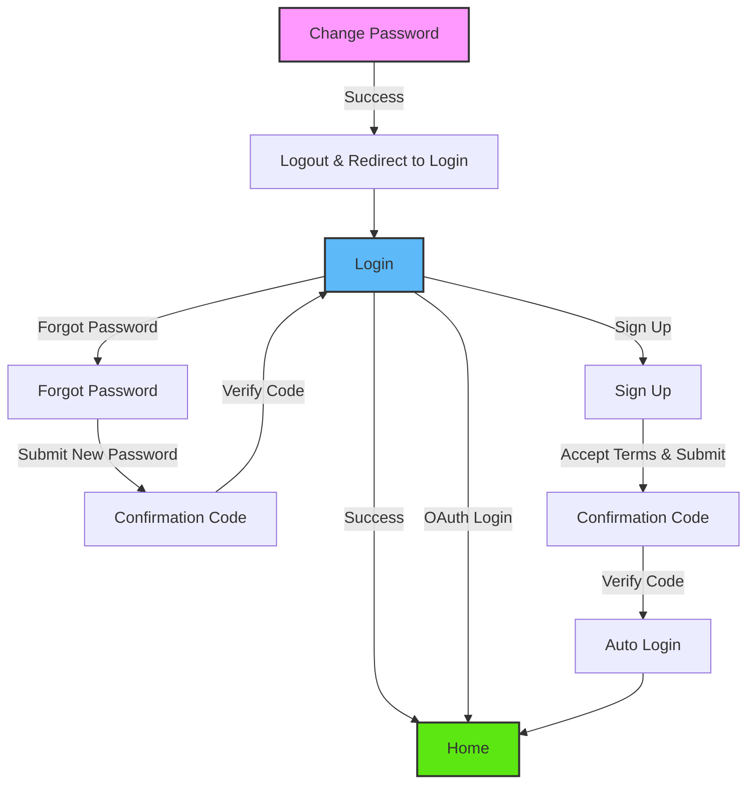

# Authentication

<details>
<summary><strong>Overview</strong></summary>

The authentication module provides a complete user authentication flow including login, signup, password management, and email verification. It uses the CDF (Central Data Framework) for handling authentication operations and supports OAuth providers.

</details>

<details>
<summary><strong>Screens and Input fields</strong></summary>

### 1. Login Screen (`Login.tsx`)

- **Purpose**: Main entry point for user authentication
- **CDF Functions**:
  - `store.userStore.login(email, password)`
  - `store.userStore.authInstance.loginWithOauth(provider)`
- **Features**:
  - Email/Password login with validation
  - OAuth support (Google, Apple - configurable via app.json)
  - Input validation with real-time feedback
  - Error handling with toast notifications
  - Navigation to forgot password/signup

### 2. Signup Screen (`Signup.tsx`)

- **Purpose**: New user registration with terms consent
- **CDF Functions**:
  - `store.userStore.authInstance.sendSignUpCode(email, password)`
- **Features**:
  - Email validation with debounced input
  - Password and confirm password validation
  - Terms of Use and Privacy Policy consent checkbox
  - Links to open Terms/Privacy in web browser
  - Error handling with toast notifications
  - Redirects to confirmation code screen

### 3. Confirmation Code Screen (`ConfirmationCode.tsx`)

- **Purpose**: Handles email verification codes for both signup and password reset
- **CDF Functions**:
  - `store.userStore.authInstance.confirmSignUp(email, code)`
  - `store.userStore.authInstance.setNewPassword(email, password, code)`
  - `store.userStore.authInstance.sendSignUpCode()` (for resend)
  - `store.userStore.authInstance.forgotPassword()` (for resend)
  - `store.userStore.login(email, password)` (auto-login after signup)
- **Features**:
  - 6-digit numeric code input with auto-focus
  - Resend functionality with 60-second countdown timer
  - Multi-purpose handling (signup vs password reset)
  - Auto-login after successful signup verification
  - Error handling for different verification scenarios

### 4. Forgot Password Screen (`Forgot.tsx`)

- **Purpose**: Password reset flow with new password setup
- **CDF Functions**:
  - `store.userStore.authInstance.forgotPassword(email)`
- **Features**:
  - Email input with validation
  - New password and confirm password fields
  - Real-time password matching validation
  - Redirects to confirmation code screen for verification
  - Error handling with toast notifications

### 5. Change Password Screen (`ChangePassword.tsx`)

- **Purpose**: Password change for authenticated users
- **CDF Functions**:
  - `store.userStore.user.changePassword(oldPassword, newPassword)`
  - `store.userStore.user.logout()`
- **Features**:
  - Current password verification
  - New password with confirmation
  - Validation prevents using same password
  - Auto logout after successful password change
  - Redirects to login screen after change
  </details>

<details>
<summary><strong>Common CDF Patterns</strong></summary>

1. **Authentication Instance Access**:

   ```typescript
   const { store } = useCDF();
   // For auth operations
   store.userStore.authInstance?.[method]();
   // For user operations
   store.userStore.user?.[method]();
   // For direct login
   store.userStore.login(email, password);
   ```

2. **Error Handling Pattern with Toast**:

   ```typescript
   const toast = useToast();

   try {
     const result = await store.userStore.authInstance?.[method]();
     if (result.status === "success") {
       // Handle success
       toast.showSuccess("Success message");
     } else {
       toast.showError("Error title", result.description);
     }
   } catch (error) {
     toast.showError(
       "Error title",
       error.description || t("auth.errors.fallback")
     );
   }
   ```

3. **Loading State Management**:

   ```typescript
   setIsLoading(true);
   try {
     // API calls
   } finally {
     setIsLoading(false);
   }
   ```

4. **Form Validation Pattern**:

   ```typescript
   const [isFieldValid, setIsFieldValid] = useState(false);

   const fieldValidator = (
     value: string
   ): { isValid: boolean; error?: string } => {
     if (!value.trim()) return { isValid: false };
     // Additional validation logic
     return { isValid: true };
   };

   const handleFieldChange = (value: string, isValid: boolean) => {
     setFieldValue(value.trim());
     setIsFieldValid(isValid);
   };
   ```

5. **Navigation Patterns**:

   ```typescript
   // Push to new screen with params
   router.push({
     pathname: "/(auth)/ConfirmationCode",
     params: { email, type: SIGNUP_CODE_TYPE, password },
   });

   // Replace current screen
   router.replace("/(group)/Home");

   // Dismiss to specific screen
   router.dismissTo("/(auth)/Login");
   ```

   </details>

## Navigation Flow



The authentication flow consists of four main paths:

1. **Login Path**: Direct login (email/password or OAuth) → Home
2. **Registration Path**: Login → Sign Up (with consent) → Confirmation Code → Auto Login → Home
3. **Password Reset Path**: Login → Forgot Password → Confirmation Code → Login
4. **Password Change Path**: Change Password → Auto Logout → Login
