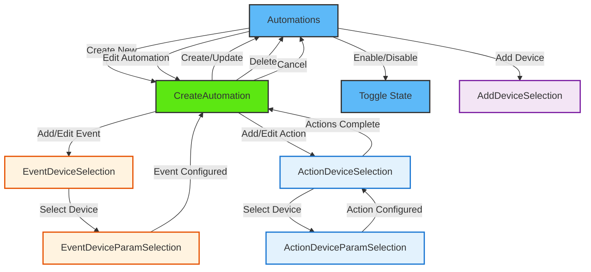

# Automation

<details>
<summary><strong>Overview</strong></summary>

The automation module provides comprehensive functionality for managing device automations across multiple nodes in the ESP RainMaker system. It allows users to get, create, edit, and delete automations that can control multiple devices based on specific events and conditions using the CDF (Central Data Framework) and SDK.

</details>

<details>
<summary><strong>Screens and Features</strong></summary>

### 1. Automations Screen (`Automations.tsx`)

- **Purpose**: Main screen for automation management and control
- **Key Features**:
  - Lists all available automations
  - Automation enable/disable toggle with loading states
  - Automation management: edit, delete functionality
  - Pull-to-refresh automation synchronization
  - Empty state handling for no automations or devices
  - Navigation to automation creation screen
  - Filter automations by current home's devices
- **CDF Function**:

  ```typescript
  // Automation synchronization with CDF
  await automationStore.syncAutomationList();
  ```

- **SDK Function**:

  ```typescript
  // Automation enable/disable
  await automation.enable(enabled);

  // Automation deletion
  await automation.delete();
  ```

### 2. Create Automation Screen (`CreateAutomation.tsx`)

- **Purpose**: Comprehensive automation creation, editing, and deletion screen
- **Key Features**:
- Automation name input and validation (duplicate name checking)
- Event and action display
- Automation configuration using automation context
- Dual-mode operation: create new automations or edit existing ones
- Automation deletion
- Retrigger toggle configuration
- Navigation to EventDeviceSelection and ActionDeviceSelection
- Loading states for all operations
- **SDK Functions**:

```typescript
// Create new automation
const automationDetails: ESPAutomationDetails = {
  name: state.automationName,
  retrigger: state.retrigger,
  eventOperator: state.eventOperator,
  events: automationEvents,
  actions: automationActions,
};
await node.addAutomation(automationDetails);

// Edit existing automation
await automation.update(automationPayload);

// Delete automation
await automation.delete();
```

### 3. Event Device Selection Screen (`EventDeviceSelection.tsx`)

- **Purpose**: Device selection screen for automation event triggers
- **Key Features**:
  - Lists all available devices from current home nodes
  - Device connectivity status monitoring
  - Device selection for event configuration
  - Navigation to EventDeviceParamSelection
  - Filters devices that can be used as event triggers
  - Highlights currently selected event device when editing
- **CDF Functions**:

  ```typescript
  // Get nodes from current home
  const home = store.groupStore._groupsByID[store.groupStore.currentHomeId];
  const automationNodes = nodeList.filter((node) =>
    home.nodes?.includes(node.id)
  );

  // Filter devices with parameters for events
  const devices = node.nodeConfig?.devices?.filter(
    (device) => device.params && device.params.length > 0
  );
  ```

### 4. Event Device Parameter Selection Screen (`EventDeviceParamSelection.tsx`)

- **Purpose**: Device parameter configuration screen for automation event conditions
- **Key Features**:
  - Lists selected device parameters for event configuration
  - Parameter condition selection (equals, greater than, less than, etc.)
  - Event trigger value configuration with appropriate controls
  - Modal-based parameter editing interface with condition operators
  - Parameter filtering (excludes name and hidden parameters)
  - Support for boolean and numeric parameter conditions
- **Automation Context**:

  ```typescript
  // Create automation event
  const automationEvent: ESPAutomationEvent = {
    deviceName: selectedDevice.name,
    param: activeEventParam,
    check: eventCondition,
    value: eventValue,
  };

  // Add event to automation context
  addEvent(automationEvent);
  ```

### 5. Action Device Selection Screen (`ActionDeviceSelection.tsx`)

- **Purpose**: Device selection and management screen for automation actions
- **Key Features**:
  - Lists all available devices for automation actions
  - Device selection/deselection with visual feedback
  - Device connectivity status monitoring
  - Action device management (add/remove from automations)
  - Event summary display showing trigger conditions
  - Navigation to ActionDeviceParamSelection for parameter configuration
- **Automation Context**:

  ```typescript
  // Check if device has actions configured
  const isSelected = checkActionExists(node.id, device.name).exist;

  // Delete action from context if device is removed from selection
  deleteAction(device.node.id, device.device.name);
  ```

### 6. Action Device Parameter Selection Screen (`ActionDeviceParamSelection.tsx`)

- **Purpose**: Device parameter configuration screen for automation actions
- **Key Features**:
  - Lists selected device parameters for action configuration
  - Parameter value configuration with appropriate controls
  - Modal-based parameter editing interface
  - Parameter filtering (excludes name and hidden parameters)
  - Multiple parameter selection per device
  - Parameter value setting and deletion
- **Automation Context**:

  ```typescript
  // Set action value for device parameter
  setActionValue(nodeId, deviceName, paramName, value);

  // Delete action value
  deleteActionValue(nodeId, deviceName, paramName);

  // Get current action value
  const value = getActionValue(nodeId, deviceName, paramName);
  ```

</details>

<details>
<summary><strong>Common CDF Patterns</strong></summary>

1. **Store Access Pattern**:

   ```typescript
   const { store } = useCDF();
   const { automationStore, groupStore, nodeStore } = store;
   ```

2. **Automation Data Synchronization**:

   ```typescript
   // Synchronize automations from cloud
   await automationStore.syncAutomationList();

   // Access synchronized data
   const { nodeAutomationList } = automationStore;
   const automation = automationStore.getAutomationById(automationId);
   ```

3. **Error Handling Pattern**:

   ```typescript
   try {
     const result = await automationOperation();
     toast.showSuccess(t("automation.operationSuccess"));
   } catch (error: unknown) {
     console.error("Automation operation error:", error);
     toast.showError(
       t("automation.operationFailed"),
       (error as ESPAPIError).description || t("automation.errors.fallback")
     );
   }
   ```

4. **Loading State Pattern**:

   ```typescript
   const [isLoading, setIsLoading] = useState(false);

   const handleAutomationOperation = async () => {
     setIsLoading(true);
     try {
       await automationOperation();
       // Handle success
     } catch (error) {
       // Handle error
     } finally {
       setIsLoading(false);
     }
   };
   ```

5. **MobX Observation Pattern**:

   ```typescript
   import { observer } from "mobx-react-lite";

   const Component = observer(() => {
     const { nodeAutomationList } = automationStore;
     return <AutomationList automations={nodeAutomationList} />;
   });
   ```

</details>

## Automation Context (useAutomation Hook)

The `useAutomation` hook provides centralized state management for automation operations using React Context and useReducer pattern.

### State Management

```typescript
interface AutomationState {
  forceUpdateUI: number; // Force UI re-renders
  automationName: string; // Current automation name
  automationId: string; // Current automation ID
  isEditing: boolean; // Edit mode flag
  nodeId: string; // Node ID for automation
  enabled: boolean; // Automation enabled state
  retrigger: boolean; // Retrigger configuration
  eventType: ESPAutomationEventType; // Event type
  eventOperator: ESPAutomationEventOperator; // Event operator (AND/OR)
  events: (
    | ESPAutomationEvent
    | ESPWeatherEvent
    | ESPWeatherCondition
    | ESPDaylightEvent
  )[]; // Automation events
  prevActions: Record<string, any>; // Previous action state
  actions: Record<string, any>; // Current automation actions
  selectedDevice: {
    // Currently selected device for actions
    nodeId: string;
    deviceName: string;
    displayName: string;
  } | null;
  selectedEventDevice: {
    // Currently selected device for events
    nodeId: string;
    deviceName: string;
    displayName: string;
  } | null;
}
```

### Context Provider Functions

#### Automation Information Management

```typescript
// Set automation information from existing automation
setAutomationInfo(automation: ESPAutomation): void;

// Set automation name
setAutomationName(name: string): void;

// Set automation ID
setAutomationId(id: string): void;

// Set automation actions (nested object format)
setAutomationActions(actions: Record<string, any>): void;

// Set previous actions state
setPrevActions(actions: Record<string, any>): void;

// Set editing mode
setEditingMode(isEditing: boolean): void;

// Set node ID
setNodeId(nodeId: string): void;

// Set enabled state
setEnabled(enabled: boolean): void;

// Set retrigger option
setRetrigger(retrigger: boolean): void;

// Set event type
setEventType(eventType: ESPAutomationEventType): void;

// Set event operator (AND/OR)
setEventOperator(operator: ESPAutomationEventOperator): void;

// Reset entire state
resetState(): void;
```

#### Action Management

```typescript
// Check if action exists for device/parameter
checkActionExists(nodeId: string, device?: string, param?: string): {
  exist: boolean;
  value?: any
};

// Set action value for device parameter
setActionValue(nodeId: string, device: string, param: string, value: any): void;

// Delete specific action value
deleteActionValue(nodeId: string, device: string, param: string): void;

// Delete entire device action
deleteAction(nodeId: string, device: string): void;

// Get action value for device parameter
getActionValue(nodeId: string, device: string, param: string): any;

// Get all automation actions in API format
getAutomationActions(): ESPAutomationAction[];
```

#### Event Management

```typescript
// Add event to automation
addEvent(event: ESPAutomationEvent | ESPWeatherEvent | ESPWeatherCondition | ESPDaylightEvent): void;

// Remove event by index
removeEvent(index: number): void;

// Update existing event
updateEvent(index: number, event: ESPAutomationEvent | ESPWeatherEvent | ESPWeatherCondition | ESPDaylightEvent): void;
```

#### Device Operations

```typescript
// Set currently selected device for actions
setSelectedDevice(device: {
  nodeId: string;
  deviceName: string;
  displayName: string
} | null): void;

// Set currently selected device for events
setSelectedEventDevice(device: {
  nodeId: string;
  deviceName: string;
  displayName: string
} | null): void;

// Check if device is disabled and why
checkDeviceDisabled(isConnected: boolean): {
  isDisabled: boolean;
  reason?: "offline";
};
```

## Navigation Flow



The automation module flow consists of several main paths:

1. **Automation Management**:

   - Automations → CreateAutomation (new/edit)
   - Direct enable/disable toggle from Automations list
   - Navigation to device provisioning when no devices available

2. **Event Configuration Flow**:

   - CreateAutomation → EventDeviceSelection → EventDeviceParamSelection → back to CreateAutomation
   - Events are configured first with device and parameter conditions

3. **Action Configuration Flow**:

   - CreateAutomation → ActionDeviceSelection → ActionDeviceParamSelection → back to ActionDeviceSelection → back to CreateAutomation
   - Actions can be configured for multiple devices and parameters
   - Users can return to ActionDeviceSelection to add more devices

4. **Automation Operations**:
   - Create: Complete event and action configuration → save automation
   - Update: Modify existing automation → save changes
   - Delete: Remove automation from system
   - Cancel: Return to Automations list without saving

## Key Differences from Scene Module

1. **Events vs Triggers**: Automations use events (conditions) to trigger actions, while scenes are manually activated
2. **Conditional Logic**: Automations support conditional operators (==, >, <, !=, >=, <=) for events
3. **Retrigger Option**: Automations can be configured to retrigger when conditions are met again
4. **Event-Action Flow**: Two-step configuration process (events first, then actions) vs scenes' direct action configuration
5. **State Management**: More complex state management due to event-action relationships and conditional logic

<details>
<summary><strong>CDF Documentation Links</strong></summary>

- **CDF AutomationStore**: Manages all automation operations including create, edit, delete, and enable/disable
- **CDF NodeStore**: Provides access to nodes and devices for automation configuration
- **Automation Context**: React Context-based state management for automation operations
- **MobX Integration**: Reactive updates for automation data changes through CDF stores
- **Event Management**: Handles automation events with conditional operators and triggers
- **Action Management**: Manages automation actions across multiple devices and parameters
</details>
