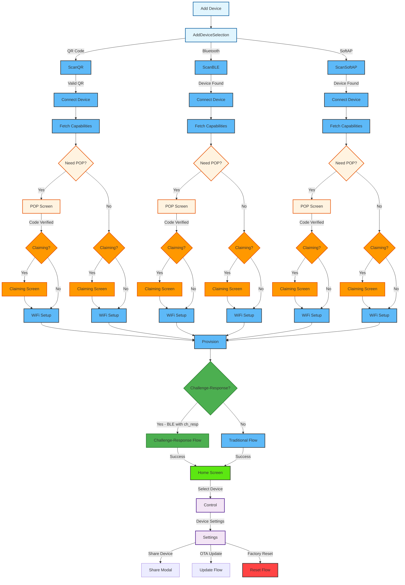

# Device

<details>
<summary><strong>Overview</strong></summary>

The device module manages device discovery, provisioning, control, and settings within the application. It uses the CDF (Central Data Framework) and SDK for handling device operations, including multiple provisioning methods (BLE, QR Code, SoftAP), WiFi configuration, and device management.

</details>

<details>
<summary><strong>Screens and Features</strong></summary>

### 1. Add Device Selection Screen (`AddDeviceSelection.tsx`)

- **Purpose**: Entry point for device provisioning - allows users to choose provisioning method
- **Key Features**:
  - Three provisioning options: QR Code, Bluetooth (BLE), and SoftAP
  - Clean card-based UI with icons and descriptions
  - Navigation to specific provisioning screens
- **Navigation Routes**:
  - QR Code → `/ScanQR`
  - Bluetooth → `/ScanBLE`
  - SoftAP → `/ScanSoftAP`
- **Translation Keys**: `device.addDeviceSelection.*`

### 2. BLE Scan Screen (`ScanBLE.tsx`)

- **Purpose**: Discover and connect to ESP devices via Bluetooth Low Energy
- **Key Features**:
  - BLE device scanning with prefix filtering
  - Real-time device discovery with animated scanning indicator
  - Device connection management
  - Available device types display
  - Rescan functionality
- **Steps**:
  1. Initialize BLE scanning with device prefix (default: "PROV\_")
  2. Display discovered devices and all available device types
  3. Handle device selection and connection
  4. Fetch device version info and capabilities
  5. Parse RMaker capabilities to detect POP and claiming support
  6. If POP required: Navigate to POP screen (with claiming capability info)
  7. If no POP required: Initialize session, then navigate to Claiming screen (if claiming supported) or WiFi setup
- **CDF/SDK Functions**:

  ```typescript
  // Search for BLE devices
  const deviceList = await user.searchESPBLEDevices(1);

  // Connect to device
  const response = await device.connect();

  // Fetch version info and capabilities for claiming detection
  const versionInfo = await device.getDeviceVersionInfo();
  const provCapabilities = await device.getDeviceCapabilities();
  const rmakerCaps = parseRMakerCapabilities(versionInfo, provCapabilities);

  // Check if POP is needed
  if (rmakerCaps.requiresPop) {
    // Navigate to POP screen with claiming capability info
    // After POP verification, POP screen will navigate to Claiming (if needed) or WiFi
    router.push({
      pathname: "/(device)/POP",
      params: {
        hasClaimCap: rmakerCaps.hasClaim ? "true" : "false",
      },
    });
  } else {
    // No POP required, initialize session and check claiming
    await device.initializeSession();
    if (rmakerCaps.hasClaim) {
      // Navigate to Claiming screen
    } else {
      // Navigate to WiFi screen
    }
  }
  ```

- **SDK Documentation**: [ESPDevice](https://espressif.github.io/esp-rainmaker-app-sdk-ts/classes/ESPDevice.ESPDevice.html)

### 3. QR Code Scan Screen (`ScanQR.tsx`)

- **Purpose**: Provision devices using QR code scanning
- **Key Features**:
  - Camera-based QR code scanning with permission handling
  - Animated scanner overlay with corner markers and scan line
  - Platform-specific provisioning logic (iOS vs Android)
  - Real-time QR code validation and processing
  - Camera controls (front/back toggle, scan again)
- **Steps**:
  1. Request camera permissions
  2. Initialize camera with QR code detection
  3. Parse and validate QR code data (JSON format)
  4. Create ESP device from QR data and connect
  5. Fetch version info and capabilities
  6. Parse RMaker capabilities to detect POP and claiming support
  7. If POP required and provided in QR: Set POP and initialize session
  8. If POP required but not in QR: Still initialize session (for claim-enabled devices)
  9. Navigate to Claiming screen (if supported) or WiFi setup
- **QR Code Format**:
  ```json
  {
    "name": "device_name",
    "pop": "proof_of_possession",
    "transport": "ble|softap",
    "security": 2
  }
  ```
- **CDF/SDK Functions**:

  ```typescript
  // Create device from QR data
  const deviceInterface = await provisionAdapter.createESPDevice(
    name,
    transport,
    security,
    pop
  );
  const espDevice = new ESPDevice(deviceInterface);
  const connectResponse = await espDevice.connect();

  // Fetch version info and capabilities for claiming detection
  const versionInfo = await espDevice.getDeviceVersionInfo();
  const provCapabilities = await espDevice.getDeviceCapabilities();
  const rmakerCaps = parseRMakerCapabilities(versionInfo, provCapabilities);

  // Set POP if required
  if (rmakerCaps.requiresPop && pop) {
    await espDevice.setProofOfPossession(pop);
  }
  await espDevice.initializeSession();

  // Navigate based on claiming capability
  if (rmakerCaps.hasClaim) {
    // Navigate to Claiming screen
  } else {
    // Navigate to WiFi setup
  }
  ```

### 4. SoftAP Scan Screen (`ScanSoftAP.tsx`)

- **Purpose**: Provision devices using SoftAP (WiFi Access Point) method
- **Platform-specific Implementation**:

  **iOS Version**:

  - Simple instructional interface
  - Guides user to manually connect to device's WiFi network
  - Automatic detection of SoftAP connection
  - Direct navigation to POP or WiFi screens

  **Android Version**:

  - Full device scanning and selection interface
  - Displays discovered SoftAP devices
  - Device selection with visual indicators
  - Connection management with progress feedback

- **Key Features**:
  - Platform detection and appropriate UI rendering
  - SoftAP device discovery and connection
  - Capability-based flow control (POP vs direct WiFi)
  - Connection status feedback
  - **Note**: Assisted claiming is **NOT supported** for SoftAP transport
- **CDF/SDK Functions**:

  ```typescript
  // iOS: Check SoftAP connection
  const connectionResult = await ESPSoftAPAdapter.checkSoftAPConnection();

  // Android: Search for SoftAP devices
  const deviceList = await user.searchESPDevices(
    devicePrefix,
    ESPTransport.softap
  );

  // Connect to selected device
  const response = await device.connect();
  const capabilities = await device.getDeviceCapabilities();
  ```

### 5. Proof of Possession Screen (`POP.tsx`)

- **Purpose**: Handle device authentication using Proof of Possession codes
- **Key Features**:
  - POP code input with validation
  - Visual guide showing where to find POP code on device
  - Support for both BLE and SoftAP device flows
  - Platform-specific handling for SoftAP devices
  - Assisted claiming capability detection and navigation
- **Steps**:
  1. Display POP code input form with device image guide
  2. Validate entered POP code (max 8 characters)
  3. For SoftAP devices: Create new ESP device with POP, then navigate to WiFi setup (claiming is not supported for SoftAP)
  4. For BLE devices: Set POP on existing device, then initialize session, use claiming capability from route params (passed from ScanBLE screen)
  5. Navigate to Claiming screen (if supported) or WiFi setup
- **CDF/SDK Functions**:

  ```typescript
  // For BLE devices: Set POP and initialize session
  await device.setProofOfPossession(popCode);
  await device.initializeSession();

  // Navigate based on claiming capability (passed as params from previous screen)
  // For BLE flow: claiming capability info is passed from ScanBLE screen
  if (hasClaimCap) {
    // Navigate to Claiming screen
  } else {
    // Navigate to WiFi setup
  }

  // For SoftAP devices: Create device, then fetch capabilities
  const deviceInterface = await provisionAdapter.createESPDevice(
    deviceName,
    "softap",
    2,
    popCode
  );
  const espDevice = new ESPDevice(deviceInterface);
  // Fetch and parse capabilities, then navigate to Claiming or WiFi
  ```

### 6. Assisted Claiming Screen (`Claiming.tsx`)

- **Purpose**: Handle assisted claiming process for devices that require claiming before provisioning
- **Key Features**:
  - Automatic claiming process initiation on screen mount
  - Real-time progress updates with animated loading indicator
  - Success/failure state handling with visual feedback
  - Automatic navigation to WiFi setup on success
  - Error handling with user-friendly messages
- **When is Claiming Required?**:
  - Device's `rmaker.cap` array contains `"claim"`
  - Detected automatically after device connection and capability parsing
  - Required for devices that need to be claimed to a user account before provisioning
- **Steps**:
  1. Screen loads and automatically starts claiming process
  2. Display animated progress indicator during claiming
  3. Show real-time progress messages from SDK
  4. Handle success: Navigate to WiFi setup screen
  5. Handle failure: Display error message with OK button to go back
- **CDF/SDK Functions**:

  ```typescript
  // Get connected device from store
  const device: ESPDevice = store.nodeStore.connectedDevice;

  // Start assisted claiming with progress callback
  await device.startAssistedClaiming((response: ESPClaimResponse) => {
    setStatus(response.status);
    setProgressMessage(response.message);

    if (response.status === ESPClaimStatus.success) {
      // Navigate to WiFi setup
    } else if (response.status === ESPClaimStatus.failed) {
      // Show error message
    }
  });
  ```

- **SDK Documentation**: [ESPDevice.startAssistedClaiming](https://espressif.github.io/esp-rainmaker-app-sdk-ts/classes/ESPDevice.ESPDevice.html#startassistedclaiming)

### 7. WiFi Screen (`Wifi.tsx`)

- **Purpose**: Configure WiFi settings for device provisioning
- **Key Features**:
  - WiFi network scanning and discovery
  - Network selection modal with signal strength indicators
  - Password input with visibility toggle
  - Network refresh functionality
  - Stored WiFi credentials management
- **Steps**:
  1. Scan available WiFi networks from connected device
  2. Display networks sorted by signal strength
  3. Allow network selection from modal
  4. Input network password with validation
  5. Proceed to provisioning with credentials
- **CDF/SDK Functions**:

  ```typescript
  // Scan WiFi networks
  const networks = await device.scanWifiList();

  // Sort networks by signal strength
  networks.sort((a, b) => (b.rssi || -100) - (a.rssi || -100));

  // Store WiFi credentials for provisioning
  setSelectedNetwork({ ssid, password });
  ```

- **SDK Documentation**: [ESPDevice.scanWifiList](https://espressif.github.io/esp-rainmaker-app-sdk-ts/classes/ESPDevice.ESPDevice.html#scanwifilist)

### 8. Provision Screen (`Provision.tsx`)

- **Purpose**: Handle device provisioning process with real-time feedback
- **Key Features**:
  - Step-by-step provisioning status display
  - Visual progress indicators with animations
  - Real-time status updates from device
  - Comprehensive error handling and recovery
  - Auto-scroll status view for better UX
  - **Challenge-Response authentication support** (for BLE devices with `ch_resp` capability)
- **Provisioning Flows**:

  The screen supports two provisioning flows based on device capabilities:

  **A. Challenge-Response Flow** (for devices with `ch_resp` capability):
  1. Check device capabilities via `checkChallengeResponseCapability()`
  2. Initiate user-node mapping to get challenge from server
  3. Send challenge to device using Protocol Buffers
  4. Device signs challenge and returns signed response with node ID
  5. Verify signed response with server
  6. Set network credentials directly via `setNetworkCredentials()`
  7. Poll for node availability and complete provisioning

  **B. Traditional Flow** (for devices without challenge-response):
  1. Initialize provisioning with WiFi credentials
  2. Display provisioning steps in real-time
  3. Handle various status updates (connecting, configuring, etc.)
  4. Show success/failure states with appropriate actions
  5. Navigate to home on successful completion

- **CDF/SDK Functions**:

  ```typescript
  // Check if device supports challenge-response
  import { checkChallengeResponseCapability, ChallengeResponseHelper } from "@/utils/challengeResponseHelper";

  const versionInfo = await device.getDeviceVersionInfo();
  const supportsChallengeResponse = checkChallengeResponseCapability(
    versionInfo,
    device.transport
  );

  if (supportsChallengeResponse) {
    // Challenge-Response Flow
    // 1. Get challenge from server
    const { challenge, request_id } = await device.initiateUserNodeMapping({});

    // 2. Send challenge to device (uses Protocol Buffers)
    const deviceResponse = await ChallengeResponseHelper.sendChallengeToDevice(
      device,
      challenge
    );

    // 3. Verify with server
    await device.verifyUserNodeMapping({
      request_id,
      challenge_response: deviceResponse.signedChallenge,
      node_id: deviceResponse.nodeId,
    });

    // 4. Set network credentials directly
    await device.setNetworkCredentials(ssid, password);
  } else {
    // Traditional Flow
    await device.provision(ssid, password, handleProvisionUpdates);
  }

  // Handle provision updates (traditional flow)
  const handleProvisionUpdates = (message: ESPProvResponse) => {
    if (message.status === ESPProvResponseStatus.succeed) {
      // Handle success - device is now provisioned
    } else if (message.status === ESPProvResponseStatus.onProgress) {
      // Handle progress updates
    } else if (message.status === ESPProvResponseStatus.failed) {
      // Handle failures with error details
    }
  };
  ```

- **SDK Documentation**: [ESPDevice.provision](https://espressif.github.io/esp-rainmaker-app-sdk-ts/classes/ESPDevice.ESPDevice.html#provision)

### 9. Control Screen (`Control.tsx`)

- **Purpose**: Main device control interface with dynamic rendering
- **Key Features**:
  - Dynamic device control panel rendering based on device type
  - Device type detection and capability mapping
  - Device parameter controls (switches, sliders, etc.)
  - Schedule management integration (coming soon)
  - Group management integration (coming soon)
  - Direct access to device settings
- **Device Panel Types**:
  - `Light.tsx` - Light control panel with brightness, color, etc.
  - `Switch.tsx` - Simple on/off switch controls
  - `Temperature.tsx` - Temperature sensor and control panels
  - `Fallback.tsx` - Generic fallback for unknown device types
- **Steps**:
  1. Load device configuration from node store
  2. Detect device type and capabilities
  3. Render appropriate control panel component
  4. Handle real-time device parameter updates
  5. Provide navigation to settings and other features
- **CDF/SDK Functions**:

  ```typescript
  // Get device from store
  const node = store.nodeStore.nodeList.find((n) => n.id === id);
  const device = node.nodeConfig.devices[0];

  // Get device type and config
  const nodeType = extractNodeType(node);
  const deviceType = extractDeviceType(nodeType);
  const deviceConfig = findDeviceConfig(deviceType);

  // Render appropriate device panel
  const DevicePanel = getDevicePanelComponent(deviceType);
  ```

- **SDK Documentation**: [ESPRMNode](https://espressif.github.io/esp-rainmaker-app-sdk-ts/classes/ESPRMNode.ESPRMNode.html)

### 10. Settings Screen (`Settings.tsx`)

- **Purpose**: Comprehensive device settings and management
- **Key Features**:
  - Device name management with real-time updates
  - Device information display (firmware, model, etc.)
  - OTA (Over-The-Air) update management
  - Device sharing with other users
  - Factory reset functionality
  - Device removal from account
- **Steps**:
  1. Load device settings and information
  2. Display device details, status, and capabilities
  3. Handle device name updates with validation
  4. Manage OTA updates with progress tracking
  5. Handle device sharing via email
  6. Provide factory reset with confirmation
- **CDF/SDK Functions**:

  ```typescript
  // Update device name
  const nameParam = device.params.find(
    (param) => param.type === "esp.param.name"
  );
  await nameParam.setValue(deviceName);

  // Check for OTA updates
  const hasUpdate = await node.checkOTAUpdate();
  await node.performOTAUpdate();

  // Share device with user
  const res = await node.shareWith({ username: email });

  // Factory reset
  await node.setMultipleParams({
    [systemService]: [
      {
        [factoryResetParam]: true,
      },
    ],
  });

  // Remove device
  await node.removeDevice();
  ```

- **SDK Documentation**: [ESPRMNode](https://espressif.github.io/esp-rainmaker-app-sdk-ts/classes/ESPRMNode.ESPRMNode.html)
</details>

<details>
<summary><strong>Assisted Claiming Support</strong></summary>

### Overview

Assisted claiming is a feature that allows devices to be claimed to a user account before provisioning. This is automatically detected and handled during the device provisioning flow.

### How Claiming is Detected

1. **After Device Connection**: Once a device is connected to BLE, the app fetches:

   - Device version info (`getDeviceVersionInfo()`)
   - Provisioning capabilities (`getDeviceCapabilities()`)

2. **Capability Parsing**: The app parses RMaker capabilities using `parseRMakerCapabilities()`:

   ```typescript
   import { parseRMakerCapabilities } from "@/utils/rmakerCapabilities";

   const versionInfo = await device.getDeviceVersionInfo();
   const provCapabilities = await device.getDeviceCapabilities();
   const rmakerCaps = parseRMakerCapabilities(versionInfo, provCapabilities);
   ```

3. **Claiming Detection**: The function checks the `rmaker.cap` array in the version info:

   - `"claim"` → Assisted claiming

   ```typescript
   if (rmakerCaps.hasClaim) {
     // Navigate to Claiming screen
   }
   ```

### Claiming Flow Integration

The claiming step is integrated into BLE and QR Code provisioning methods with the following order:

- **BLE Scanning** (`ScanBLE.tsx`):

  - If POP required: Navigate to POP → After POP verification → Claiming (if supported) → WiFi
  - If no POP: Initialize session → Claiming (if supported) → WiFi

- **QR Code Scanning** (`ScanQR.tsx`):

  - If POP in QR: Set POP → Initialize session → Claiming (if supported) → WiFi
  - If POP required but not in QR: Initialize session → Claiming (if supported) → WiFi
  - If no POP: Initialize session → Claiming (if supported) → WiFi

- **SoftAP** (`ScanSoftAP.tsx`): **Assisted claiming is NOT supported for SoftAP transport**
- **POP Screen** (`POP.tsx`): After POP verification, navigates to Claiming (if supported) or WiFi

### Claiming Process

1. **Automatic Start**: The Claiming screen automatically starts the claiming process on mount
2. **Progress Updates**: Real-time progress messages from the SDK are displayed
3. **Success**: Automatically navigates to WiFi setup after successful claiming
4. **Failure**: Displays error message with option to go back

### SDK Integration

The claiming process uses the SDK's `startAssistedClaiming()` method:

```typescript
await device.startAssistedClaiming((response: ESPClaimResponse) => {
  // Handle progress updates
  setStatus(response.status);
  setProgressMessage(response.message);
});
```

For more details, see the [ESPDevice.startAssistedClaiming](https://espressif.github.io/esp-rainmaker-app-sdk-ts/classes/ESPDevice.ESPDevice.html#startassistedclaiming) SDK documentation.

</details>

<details>
<summary><strong>Challenge-Response Support</strong></summary>

### Overview

Challenge-response is a secure authentication mechanism that ensures only legitimate ESP devices can be associated with user accounts. This feature is automatically detected and used during the provisioning flow for BLE devices that support it.

### How Challenge-Response Works

1. **Server sends a challenge** - A random string generated by the server
2. **Device signs the challenge** - Device uses its private key to sign the challenge
3. **Server verifies the signature** - Server validates the signature using the device's public key
4. **Authentication succeeds** - Device is authenticated and associated with the user account

### How Challenge-Response is Detected

1. **After Device Connection**: Once a device is connected via BLE, the app fetches device version info
2. **Capability Check**: The app checks for `ch_resp` capability in `versionInfo.rmaker_extra.cap`
3. **Transport Check**: Challenge-response is only supported for BLE transport (not SoftAP)

```typescript
import { checkChallengeResponseCapability } from "@/utils/challengeResponseHelper";

const versionInfo = await device.getDeviceVersionInfo();
const supportsChallengeResponse = checkChallengeResponseCapability(
  versionInfo,
  device.transport // Must be 'BLE'
);
```

### Challenge-Response Flow

When a device supports challenge-response, the provisioning flow changes:

1. **Initiate User-Node Mapping**: Request challenge from server

   ```typescript
   const { challenge, request_id } = await device.initiateUserNodeMapping({});
   ```

2. **Send Challenge to Device**: Uses Protocol Buffers for binary communication

   ```typescript
   import { ChallengeResponseHelper } from "@/utils/challengeResponseHelper";

   const deviceResponse = await ChallengeResponseHelper.sendChallengeToDevice(
     device,
     challenge
   );
   // Returns: { success, nodeId, signedChallenge }
   ```

3. **Verify with Server**: Server validates the device's signature

   ```typescript
   await device.verifyUserNodeMapping({
     request_id,
     challenge_response: deviceResponse.signedChallenge,
     node_id: deviceResponse.nodeId,
   });
   ```

4. **Set Network Credentials**: Direct credential setting (not `provision()`)

   ```typescript
   await device.setNetworkCredentials(ssid, password);
   ```

### Backward Compatibility

The implementation is **fully backward compatible**:

- If device doesn't support challenge-response → Traditional provisioning flow
- If device uses SoftAP transport → Traditional provisioning flow
- If challenge-response fails → Error is displayed (no automatic fallback)
- No breaking changes to existing provisioning

### Files Involved

- `utils/challengeResponseHelper.ts` - Helper class and capability checking
- `proto-ts/esp_rmaker_chal_resp.ts` - Protocol Buffer classes for device communication
- `app/(device)/Provision.tsx` - Provisioning screen with dual-flow support

For more details, see the [Challenge-Response Implementation Guide](/docs/CHALLENGE_RESPONSE.md).

</details>

<details>
<summary><strong>Common CDF Patterns</strong></summary>

1. **Device Store Access Pattern**:

   ```typescript
   const { store } = useCDF();
   const { nodeStore } = store;
   ```

2. **Device Access Pattern**:

   ```typescript
   const node = nodeStore.nodeList.find((n) => n.id === id);
   const device = node.nodeConfig.devices[0];
   ```

3. **Error Handling Pattern**:

   ```typescript
   try {
     const result = await operation();
     if (result.status === "success") {
       toast.showSuccess(successMessage);
     } else {
       toast.showError(result.description);
     }
   } catch (error) {
     toast.showError(error.description);
   }
   ```

4. **Loading State Pattern**:
   ```typescript
   setIsLoading(true);
   try {
     await operation();
     // Handle success
   } catch (error) {
     // Handle error
   } finally {
     setIsLoading(false);
   }
   ```
   </details>

## Navigation Flow



The device module now consists of three main flows:

### 1. **Device Provisioning Flow**

- **Entry**: AddDeviceSelection → Choose provisioning method
- **Discovery**: ScanQR/ScanBLE/ScanSoftAP → Find and connect to device
- **Capability Detection**: Fetch version info and capabilities → Parse RMaker capabilities
- **Authentication**: POP Screen (if required) → Verify device ownership
  - **Note**: For BLE flow, POP comes **before** claiming. After POP verification, the flow proceeds to claiming if supported.
- **Claiming**: Assisted Claiming Screen (if device supports claiming) → Claim device to user account
  - **Note**: Claiming happens **after** POP verification (if POP was required) or after session initialization (if no POP)
- **Configuration**: WiFi Setup → Configure network credentials
- **Completion**: Provision → Complete device setup → Home
  - **Challenge-Response**: For BLE devices with `ch_resp` capability, the Provision screen uses challenge-response authentication before setting network credentials

**Flow Order for BLE**: Connect → Check capabilities → **POP (if required)** → **Claiming (if supported)** → WiFi → Provision (**Challenge-Response if supported**)

**Flow Order for QR**: Connect → Check capabilities → Set POP (if in QR) → Initialize session → **Claiming (if supported)** → WiFi → Provision (**Challenge-Response if supported**)

### 2. **Device Management Flow**

- **Access**: Home → Control → Device interaction and settings
- **Settings**: Device configuration, updates, sharing, and reset

### 3. **Platform-Specific Variations**

- **iOS SoftAP**: Simplified flow with manual WiFi connection
- **Android SoftAP**: Full device scanning and selection interface
- **QR Code**: Direct device creation from scanned data
- **BLE**: Traditional Bluetooth Low Energy discovery

<details>
<summary><strong>SDK Documentation Links</strong></summary>

- [ESPDevice Documentation](https://espressif.github.io/esp-rainmaker-app-sdk-ts/classes/ESPDevice.ESPDevice.html)
- [ESPRMNode Documentation](https://espressif.github.io/esp-rainmaker-app-sdk-ts/classes/ESPRMNode.ESPRMNode.html)
- [ESPProvResponse Documentation](https://espressif.github.io/esp-rainmaker-app-sdk-ts/interfaces/types_provision.ESPProvisionAdapterInterface.html)
</details>
