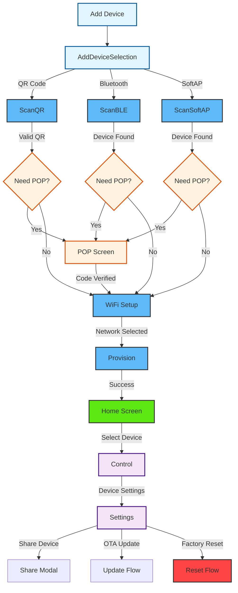

# Device

<details>
<summary><strong>Overview</strong></summary>

The device module manages device discovery, provisioning, control, and settings within the application. It uses the CDF (Central Data Framework) and SDK for handling device operations, including multiple provisioning methods (BLE, QR Code, SoftAP), WiFi configuration, and device management.

</details>

<details>
<summary><strong>Screens and Features</strong></summary>

### 1. Add Device Selection Screen (`AddDeviceSelection.tsx`)

- **Purpose**: Entry point for device provisioning - allows users to choose provisioning method
- **Key Features**:
  - Three provisioning options: QR Code, Bluetooth (BLE), and SoftAP
  - Clean card-based UI with icons and descriptions
  - Navigation to specific provisioning screens
- **Navigation Routes**:
  - QR Code → `/ScanQR`
  - Bluetooth → `/ScanBLE`
  - SoftAP → `/ScanSoftAP`
- **Translation Keys**: `device.addDeviceSelection.*`

### 2. BLE Scan Screen (`ScanBLE.tsx`)

- **Purpose**: Discover and connect to ESP devices via Bluetooth Low Energy
- **Key Features**:
  - BLE device scanning with prefix filtering
  - Real-time device discovery with animated scanning indicator
  - Device connection management
  - Available device types display
  - Rescan functionality
- **Steps**:
  1. Initialize BLE scanning with device prefix (default: "PROV\_")
  2. Display discovered devices and all available device types
  3. Handle device selection and connection
  4. Check device capabilities for POP requirement
  5. Navigate to POP screen or WiFi setup based on capabilities
- **CDF/SDK Functions**:

  ```typescript
  // Search for BLE devices
  const deviceList = await user.searchESPBLEDevices(1);

  // Connect to device
  const response = await device.connect();
  const capabilities = await device.getDeviceCapabilities();

  // Check if POP is needed
  if (!capabilities.includes("no_pop") || !capabilities.includes("no_sec")) {
    // Navigate to POP screen
  } else {
    await device.initializeSession();
    // Navigate to WiFi screen
  }
  ```

- **SDK Documentation**: [ESPDevice](https://espressif.github.io/esp-rainmaker-app-sdk-ts/classes/ESPDevice.ESPDevice.html)

### 3. QR Code Scan Screen (`ScanQR.tsx`)

- **Purpose**: Provision devices using QR code scanning
- **Key Features**:
  - Camera-based QR code scanning with permission handling
  - Animated scanner overlay with corner markers and scan line
  - Platform-specific provisioning logic (iOS vs Android)
  - Real-time QR code validation and processing
  - Camera controls (front/back toggle, scan again)
- **Steps**:
  1. Request camera permissions
  2. Initialize camera with QR code detection
  3. Parse and validate QR code data (JSON format)
  4. Create ESP device from QR data
  5. Handle platform-specific connection logic
  6. Navigate to WiFi setup
- **QR Code Format**:
  ```json
  {
    "name": "device_name",
    "pop": "proof_of_possession",
    "transport": "ble|softap",
    "security": 2
  }
  ```
- **CDF/SDK Functions**:
  ```typescript
  // Create device from QR data
  const deviceInterface = await provisionAdapter.createESPDevice(
    name,
    transport,
    security,
    pop
  );
  const espDevice = new ESPDevice(deviceInterface);
  const connectResponse = await espDevice.connect();
  ```

### 4. SoftAP Scan Screen (`ScanSoftAP.tsx`)

- **Purpose**: Provision devices using SoftAP (WiFi Access Point) method
- **Platform-specific Implementation**:

  **iOS Version**:

  - Simple instructional interface
  - Guides user to manually connect to device's WiFi network
  - Automatic detection of SoftAP connection
  - Direct navigation to POP or WiFi screens

  **Android Version**:

  - Full device scanning and selection interface
  - Displays discovered SoftAP devices
  - Device selection with visual indicators
  - Connection management with progress feedback

- **Key Features**:
  - Platform detection and appropriate UI rendering
  - SoftAP device discovery and connection
  - Capability-based flow control (POP vs direct WiFi)
  - Connection status feedback
- **CDF/SDK Functions**:

  ```typescript
  // iOS: Check SoftAP connection
  const connectionResult = await ESPSoftAPAdapter.checkSoftAPConnection();

  // Android: Search for SoftAP devices
  const deviceList = await user.searchESPDevices(
    devicePrefix,
    ESPTransport.softap
  );

  // Connect to selected device
  const response = await device.connect();
  const capabilities = await device.getDeviceCapabilities();
  ```

### 5. Proof of Possession Screen (`POP.tsx`)

- **Purpose**: Handle device authentication using Proof of Possession codes
- **Key Features**:
  - POP code input with validation
  - Visual guide showing where to find POP code on device
  - Support for both BLE and SoftAP device flows
  - Platform-specific handling for SoftAP devices
- **Steps**:
  1. Display POP code input form with device image guide
  2. Validate entered POP code (max 8 characters)
  3. For SoftAP devices: Create new ESP device with POP
  4. For BLE devices: Set POP on existing device
  5. Initialize session and navigate to WiFi setup
- **CDF/SDK Functions**:

  ```typescript
  // Set POP for BLE devices
  await device.setProofOfPossession(popCode);
  await device.initializeSession();

  // Create SoftAP device with POP
  const deviceInterface = await provisionAdapter.createESPDevice(
    deviceName,
    "softap",
    2,
    popCode
  );
  ```

### 6. WiFi Screen (`Wifi.tsx`)

- **Purpose**: Configure WiFi settings for device provisioning
- **Key Features**:
  - WiFi network scanning and discovery
  - Network selection modal with signal strength indicators
  - Password input with visibility toggle
  - Network refresh functionality
  - Stored WiFi credentials management
- **Steps**:
  1. Scan available WiFi networks from connected device
  2. Display networks sorted by signal strength
  3. Allow network selection from modal
  4. Input network password with validation
  5. Proceed to provisioning with credentials
- **CDF/SDK Functions**:

  ```typescript
  // Scan WiFi networks
  const networks = await device.scanWifiList();

  // Sort networks by signal strength
  networks.sort((a, b) => (b.rssi || -100) - (a.rssi || -100));

  // Store WiFi credentials for provisioning
  setSelectedNetwork({ ssid, password });
  ```

- **SDK Documentation**: [ESPDevice.scanWifiList](https://espressif.github.io/esp-rainmaker-app-sdk-ts/classes/ESPDevice.ESPDevice.html#scanwifilist)

### 7. Provision Screen (`Provision.tsx`)

- **Purpose**: Handle device provisioning process with real-time feedback
- **Key Features**:
  - Step-by-step provisioning status display
  - Visual progress indicators with animations
  - Real-time status updates from device
  - Comprehensive error handling and recovery
  - Auto-scroll status view for better UX
- **Steps**:
  1. Initialize provisioning with WiFi credentials
  2. Display provisioning steps in real-time
  3. Handle various status updates (connecting, configuring, etc.)
  4. Show success/failure states with appropriate actions
  5. Navigate to home on successful completion
- **CDF/SDK Functions**:

  ```typescript
  // Start provisioning
  await device.provision(ssid, password, handleProvisionUpdates);

  // Handle provision updates
  const handleProvisionUpdates = (message: ESPProvResponse) => {
    if (message.status === ESPProvResponseStatus.succeed) {
      // Handle success - device is now provisioned
    } else if (message.status === ESPProvResponseStatus.onProgress) {
      // Handle progress updates
    } else if (message.status === ESPProvResponseStatus.failed) {
      // Handle failures with error details
    }
  };
  ```

- **SDK Documentation**: [ESPDevice.provision](https://espressif.github.io/esp-rainmaker-app-sdk-ts/classes/ESPDevice.ESPDevice.html#provision)

### 8. Control Screen (`Control.tsx`)

- **Purpose**: Main device control interface with dynamic rendering
- **Key Features**:
  - Dynamic device control panel rendering based on device type
  - Device type detection and capability mapping
  - Device parameter controls (switches, sliders, etc.)
  - Schedule management integration (coming soon)
  - Group management integration (coming soon)
  - Direct access to device settings
- **Device Panel Types**:
  - `Light.tsx` - Light control panel with brightness, color, etc.
  - `Switch.tsx` - Simple on/off switch controls
  - `Temperature.tsx` - Temperature sensor and control panels
  - `Fallback.tsx` - Generic fallback for unknown device types
- **Steps**:
  1. Load device configuration from node store
  2. Detect device type and capabilities
  3. Render appropriate control panel component
  4. Handle real-time device parameter updates
  5. Provide navigation to settings and other features
- **CDF/SDK Functions**:

  ```typescript
  // Get device from store
  const node = store.nodeStore.nodeList.find((n) => n.id === id);
  const device = node.nodeConfig.devices[0];

  // Get device type and config
  const nodeType = extractNodeType(node);
  const deviceType = extractDeviceType(nodeType);
  const deviceConfig = findDeviceConfig(deviceType);

  // Render appropriate device panel
  const DevicePanel = getDevicePanelComponent(deviceType);
  ```

- **SDK Documentation**: [ESPRMNode](https://espressif.github.io/esp-rainmaker-app-sdk-ts/classes/ESPRMNode.ESPRMNode.html)

### 9. Settings Screen (`Settings.tsx`)

- **Purpose**: Comprehensive device settings and management
- **Key Features**:
  - Device name management with real-time updates
  - Device information display (firmware, model, etc.)
  - OTA (Over-The-Air) update management
  - Device sharing with other users
  - Factory reset functionality
  - Device removal from account
- **Steps**:
  1. Load device settings and information
  2. Display device details, status, and capabilities
  3. Handle device name updates with validation
  4. Manage OTA updates with progress tracking
  5. Handle device sharing via email
  6. Provide factory reset with confirmation
- **CDF/SDK Functions**:

  ```typescript
  // Update device name
  const nameParam = device.params.find(
    (param) => param.type === "esp.param.name"
  );
  await nameParam.setValue(deviceName);

  // Check for OTA updates
  const hasUpdate = await node.checkOTAUpdate();
  await node.performOTAUpdate();

  // Share device with user
  const res = await node.shareWith({ username: email });

  // Factory reset
  await node.setMultipleParams({
    [systemService]: [
      {
        [factoryResetParam]: true,
      },
    ],
  });

  // Remove device
  await node.removeDevice();
  ```

- **SDK Documentation**: [ESPRMNode](https://espressif.github.io/esp-rainmaker-app-sdk-ts/classes/ESPRMNode.ESPRMNode.html)
</details>

<details>
<summary><strong>Common CDF Patterns</strong></summary>

1. **Device Store Access Pattern**:

   ```typescript
   const { store } = useCDF();
   const { nodeStore } = store;
   ```

2. **Device Access Pattern**:

   ```typescript
   const node = nodeStore.nodeList.find((n) => n.id === id);
   const device = node.nodeConfig.devices[0];
   ```

3. **Error Handling Pattern**:

   ```typescript
   try {
     const result = await operation();
     if (result.status === "success") {
       toast.showSuccess(successMessage);
     } else {
       toast.showError(result.description);
     }
   } catch (error) {
     toast.showError(error.description);
   }
   ```

4. **Loading State Pattern**:
   ```typescript
   setIsLoading(true);
   try {
     await operation();
     // Handle success
   } catch (error) {
     // Handle error
   } finally {
     setIsLoading(false);
   }
   ```
   </details>

## Navigation Flow



The device module now consists of three main flows:

### 1. **Device Provisioning Flow**

- **Entry**: AddDeviceSelection → Choose provisioning method
- **Discovery**: ScanQR/ScanBLE/ScanSoftAP → Find and connect to device
- **Authentication**: POP Screen (if required) → Verify device ownership
- **Configuration**: WiFi Setup → Configure network credentials
- **Completion**: Provision → Complete device setup → Home

### 2. **Device Management Flow**

- **Access**: Home → Control → Device interaction and settings
- **Settings**: Device configuration, updates, sharing, and reset

### 3. **Platform-Specific Variations**

- **iOS SoftAP**: Simplified flow with manual WiFi connection
- **Android SoftAP**: Full device scanning and selection interface
- **QR Code**: Direct device creation from scanned data
- **BLE**: Traditional Bluetooth Low Energy discovery

<details>
<summary><strong>SDK Documentation Links</strong></summary>

- [ESPDevice Documentation](https://espressif.github.io/esp-rainmaker-app-sdk-ts/classes/ESPDevice.ESPDevice.html)
- [ESPRMNode Documentation](https://espressif.github.io/esp-rainmaker-app-sdk-ts/classes/ESPRMNode.ESPRMNode.html)
- [ESPProvResponse Documentation](https://espressif.github.io/esp-rainmaker-app-sdk-ts/interfaces/types_provision.ESPProvisionAdapterInterface.html)
</details>
