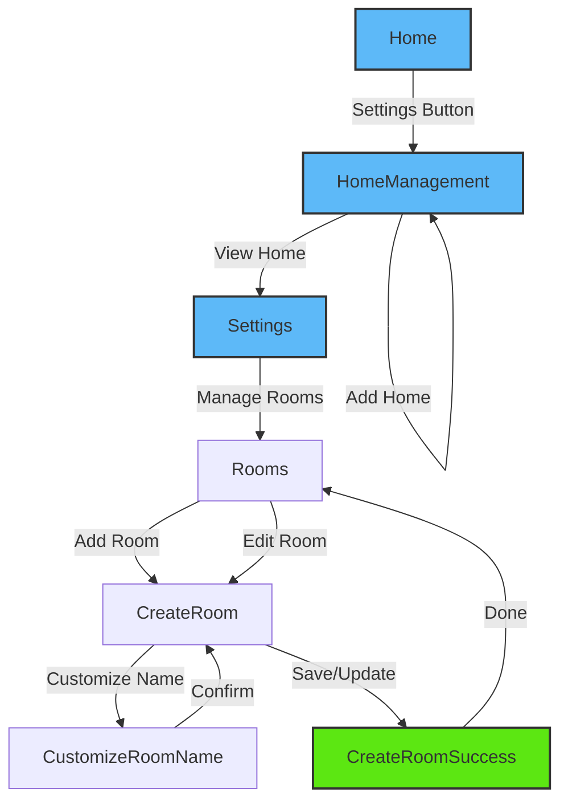

# Group

<details>
<summary><strong>Overview</strong></summary>

The group module manages homes and rooms within the application, providing functionality for creating, managing, and organizing devices into logical groups. It uses the CDF (Central Data Framework) and SDK for handling group operations.

</details>

<details>
<summary><strong>Screens and Features</strong></summary>

### 1. Home Screen (`Home.tsx`)

- **Purpose**: Main dashboard showing devices and rooms
- **Key Features**:
  - Home selection banner
  - Device listing by rooms
  - Room-based filtering tabs
  - Quick actions menu for adding devices
  - Pull-to-refresh device sync
- **CDF/SDK Functions**:

  ```typescript
  // Get homes and current home
  const homes = groupStore.groupList;
  const currentHome = groupStore.currentHomeId;

  // Get and sync devices
  const devices = nodeStore.nodeList;

  // Transform nodes to devices
  const devices = transformNodesToDevices(nodes);
  ```

- **SDK Documentation**: [ESPRMGroup](https://espressif.github.io/esp-rainmaker-app-sdk-ts/classes/ESPRMGroup.ESPRMGroup.html)

### 2. Home Management Screen (`HomeManagement.tsx`)

- **Purpose**: Manage and create homes/groups
- **Key Features**:
  - List all homes
  - Create new home
  - View home details
  - Pull-to-refresh sync
  - Home count indicators
- **CDF/SDK Functions**:

  ```typescript
  // Create new home
  const response = await userStore.user.createGroup({
    mutuallyExclusive: true,
    name: homeName,
    nodeIds: [],
    type: "home",
  });

  // Sync home list
  await fetchAllGroups();
  ```

- **SDK Documentation**: [ESPRMUser.createGroup](https://espressif.github.io/esp-rainmaker-app-sdk-ts/classes/ESPRMUser.ESPRMUser.html#creategroup)

### 3. Settings Screen (`Settings.tsx`)

- **Purpose**: Comprehensive home management and settings
- **Key Features**:
  - Edit home name (primary users only)
  - Navigate to room management
  - Home sharing management (add/remove users)
  - Pending sharing requests handling
  - Remove/leave home functionality
  - Primary/secondary user role handling
- **CDF/SDK Functions**:

  ```typescript
  // Update home name
  const response = await home.updateGroupInfo({
    groupName: newName,
  });

  // Delete home (primary) or leave (secondary)
  const action = isPrimary ? home.delete() : home.leave();

  // Share home with user
  await home.Share({
    toUserName: email,
    makePrimary: false,
  });

  // Get sharing information
  const res = await home.getSharingInfo({
    metadata: false,
    withSubGroups: false,
    withParentGroups: false,
  });
  ```

- **SDK Documentation**: [ESPRMGroup](https://espressif.github.io/esp-rainmaker-app-sdk-ts/classes/ESPRMGroup.ESPRMGroup.html)

### 4. Rooms Screen (`Rooms.tsx`)

- **Purpose**: Display and manage rooms within a home
- **Key Features**:
  - List all rooms in current home
  - Add new room with floating action button
  - Empty state with illustration and add room prompt
  - Pull-to-refresh sync
  - Room card display with device counts
  - Navigate to room editing
- **CDF/SDK Functions**:

  ```typescript
  // Get rooms from home
  const rooms = home.subGroups as ESPRMGroup[];

  // Sync group list to refresh rooms
  await fetchAllGroups();
  ```

- **SDK Documentation**: [ESPRMGroup](https://espressif.github.io/esp-rainmaker-app-sdk-ts/classes/ESPRMGroup.ESPRMGroup.html)

### 5. Create Room Screen (`CreateRoom.tsx`)

- **Purpose**: Create new room or edit existing room with device management
- **Key Features**:
  - Custom room name selection (links to CustomizeRoomName)
  - Device assignment (add/remove devices)
  - Available devices filtering
  - Room creation and updating
  - Room deletion with confirmation dialog
  - Dual mode: create new room or edit existing room
- **CDF/SDK Functions**:

  ```typescript
  // Create new room
  const response = await home.createSubGroup({
    name: roomName,
    nodeIds: selectedDevices.map((device) => device.id),
    customData: {},
    type: GROUP_TYPE_ROOM,
    mutuallyExclusive: true,
  });

  // Update existing room
  await room.updateGroupInfo({ groupName: roomName });
  await room.addNodes(nodesToAdd);
  await room.removeNodes(nodesToRemove);

  // Delete room
  await room.delete();
  ```

- **SDK Documentation**: [ESPRMGroup.createSubGroup](https://espressif.github.io/esp-rainmaker-app-sdk-ts/classes/ESPRMGroup.ESPRMGroup.html#createsubgroup)

### 6. Customize Room Name Screen (`CustomizeRoomName.tsx`)

- **Purpose**: Select predefined room name or create custom name
- **Key Features**:
  - Predefined room names list (Bedroom, Living Room, Kitchen, etc.)
  - Custom name input field
  - Selection indicators with checkmarks
  - Confirmation button with validation
- **Navigation Flow**:
  - Dismisses back to CreateRoom with selected name
  - Handles both predefined and custom room names

### 7. Create Room Success Screen (`CreateRoomSuccess.tsx`)

- **Purpose**: Success confirmation screen for room operations
- **Key Features**:
  - Success message display with illustration
  - Different messages for create vs update operations
  - Done button to return to rooms list
  - Clean navigation stack management
- **Navigation Flow**:
  - Dismisses to Rooms screen
  - Passes success parameters for UI feedback
  </details>

<details>
<summary><strong>Common CDF Patterns</strong></summary>

1. **Store Access Pattern**:

   ```typescript
   const { store } = useCDF();
   const { groupStore, nodeStore, userStore } = store;

   // Observer pattern for reactive updates
   import { observer } from "mobx-react-lite";
   export default observer(ComponentName);
   ```

2. **Group Operations Pattern**:

   ```typescript
   // Create group/room
   const response = await home.createSubGroup({
     name: roomName,
     nodeIds: selectedDevices.map((device) => device.id),
     customData: {},
     type: GROUP_TYPE_ROOM,
     mutuallyExclusive: true,
   });

   // Update group info
   await home.updateGroupInfo({ groupName: newName });

   // Add/remove nodes from group
   await room.addNodes(nodesToAdd);
   await room.removeNodes(nodesToRemove);
   ```

3. **Home Management Pattern**:

   ```typescript
   // Get current home
   const home =
     groupStore._groupsByID[groupStore.currentHomeId] ||
     groupStore.groupList[0];

   // Create default home if none exists
   await userStore.user.createGroup({
     name: DEFAULT_HOME_GROUP_NAME,
     nodeIds: [],
     type: GROUP_TYPE_HOME,
     mutuallyExclusive: true,
   });
   ```

4. **Device Transformation Pattern**:

   ```typescript
   // Transform nodes to devices
   const devices = transformNodesToDevices(nodes);

   // Filter devices by group membership
   const groupDevices = devices.filter((device) => {
     const nodeRef = device.node.deref();
     return nodeRef && group.nodes?.includes(nodeRef.id);
   });
   ```

5. **Home Sharing Pattern**:

   ```typescript
   // Share home with user
   await home.Share({
     toUserName: email,
     makePrimary: false,
   });

   // Get sharing information
   const sharingInfo = await home.getSharingInfo({
     metadata: false,
     withSubGroups: false,
     withParentGroups: false,
   });

   // Remove sharing
   await home.removeSharingFor(username);
   ```

6. **Error Handling with Toast Pattern**:

   ```typescript
   const toast = useToast();

   try {
     const result = await operation();
     toast.showSuccess(t("success.message"));
   } catch (error) {
     toast.showError(
       t("error.title"),
       error.description || t("error.fallback")
     );
   }
   ```

7. **Refresh Pattern with Loading States**:

   ```typescript
   const { store, fetchAllNodes, fetchAllGroups } = useCDF();
   const [refreshing, setRefreshing] = useState(false);

   const onRefresh = async () => {
     setRefreshing(true);
     try {
       fetchAllNodes();
       fetchAllGroups();
     } catch (error) {
       toast.showError(t("error.refreshFailed"));
     } finally {
       setRefreshing(false);
     }
   };
   ```

8. **Local Observable State Pattern**:

   ```typescript
   import { useLocalObservable } from "mobx-react-lite";

   const state = useLocalObservable(() => ({
     rooms: [] as ESPRMGroup[],
     refreshing: false,
     home: groupStore?.groupList[0],
   }));
   ```

   </details>

## Navigation Flow



The group management flow consists of two main paths:

1. **Home Management**: Home → HomeManagement → Settings
2. **Room Management**: Settings → Rooms → CreateRoom → Success

<details>
<summary><strong>SDK Documentation Links</strong></summary>

- [ESPRMGroup Documentation](https://espressif.github.io/esp-rainmaker-app-sdk-ts/classes/ESPRMGroup.ESPRMGroup.html)
- [ESPRMUser Documentation](https://espressif.github.io/esp-rainmaker-app-sdk-ts/classes/ESPRMUser.ESPRMUser.html)
- [ESPRMNode Documentation](https://espressif.github.io/esp-rainmaker-app-sdk-ts/classes/ESPRMNode.ESPRMNode.html)
</details>
