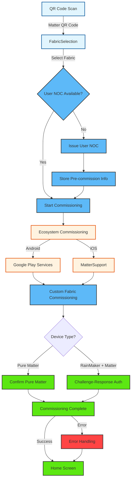

# Matter

<details>
<summary><strong>Overview</strong></summary>

The Matter module manages Matter device commissioning within the application, providing functionality for commissioning Matter devices to custom fabrics. It uses the ESP RainMaker Matter SDK for handling Matter-specific operations including fabric management, device commissioning, certificate management, and progress tracking.

</details>

<details>
<summary><strong>Screens and Features</strong></summary>

### 1. Fabric Selection Screen (`FabricSelection.tsx`)

- **Purpose**: Entry point for Matter device commissioning - allows users to select or create a Matter fabric for device commissioning
- **Key Features**:
  - Display list of available groups and fabrics
  - Fabric/group selection for commissioning
  - Real-time commissioning progress tracking
  - Commissioning status updates with descriptive messages
  - Automatic user NOC issuance when needed
  - Pre-commissioning information storage
  - Commissioning completion and error handling
- **Commissioning Flow**:
  1. User scans Matter QR code (onboarding payload)
  2. Navigate to Fabric Selection screen with QR data
  3. Select target fabric/group for commissioning
  4. System checks if user NOC is available for the fabric
  5. If not available, automatically issues user NOC
  6. Stores pre-commissioning information (user NOC, fabric metadata)
  7. Starts Matter device commissioning process
  8. Handles real-time progress updates
  9. Manages commissioning completion or errors

- **SDK Functions**:

  ```typescript
  // Get groups and fabrics
  const response = await esprmUser.getGroupsAndFabrics();
  const allItems = [...response.fabrics, ...response.groups];

  // Prepare fabric for Matter commissioning
  const fabricForCommissioning =
    await esprmUser.prepareFabricForMatterCommissioning(item);

  // Check if user NOC is available
  const isUserNocAvailableForFabric =
    await ESPMatterUtilityAdapter.isUserNocAvailableForFabric(
      fabricForCommissioning.fabricId || ""
    );

  // Issue user NOC if needed
  if (!isUserNocAvailableForFabric) {
    const response = await fabricForCommissioning.issueUserNoC();
    // Store pre-commissioning information
    await ESPMatterUtilityAdapter.storePrecommissionInfo({
      groupId: fabricForCommissioning.id,
      fabricId: fabricForCommissioning.fabricId || "",
      name: fabricForCommissioning.name,
      userNoc: response.certificates?.at(0)?.userNoC || "",
      matterUserId: fabricDetails?.matterUserId || "",
      rootCa: fabricDetails?.rootCa || "",
      // ... other metadata
    });
  }

  // Start Matter device commissioning
  await fabricForCommissioning.startCommissioning(
    qrData as string,
    progressLogger
  );
  ```

- **Event Handling**:
  - Listens to `MATTER_COMMISSIONING_EVENT` for commissioning updates
  - Handles `MATTER_EVENT_COMMISSIONING_COMPLETE` - successful commissioning
  - Handles `MATTER_EVENT_COMMISSIONING_CONFIRMATION_RESPONSE` - confirmation responses
  - Handles `MATTER_EVENT_COMMISSIONING_ERROR` - commissioning errors
- **Progress Logger**:
  ```typescript
  const progressLogger = (message: ESPCommissioningResponse) => {
    // Update UI with progress messages from the SDK
    if (message.description) {
      setCommissioningStatus(message.description);
    }
  };
  ```
</details>

## Navigation Flow



The Matter commissioning flow consists of the following stages:

### 1. **Fabric Selection**
- User scans Matter QR code from device
- Navigate to Fabric Selection screen
- Display available fabrics/groups
- User selects target fabric for commissioning

### 2. **Certificate Management**
- Check if user NOC is available for selected fabric
- If not available, automatically issue user NOC
- Store pre-commissioning information (user NOC, fabric metadata, certificates)

### 3. **Ecosystem Commissioning**
- **Android**: Launch Google Play Services for Matter commissioning
- **iOS**: Launch MatterSupport framework for Matter commissioning
- Handle ecosystem-specific UI and interactions

### 4. **Custom Fabric Commissioning**
- Commission device to custom Matter fabric
- Handle PASE (Password Authenticated Session Establishment) connection
- Generate and handle CSR (Certificate Signing Request)
- Receive and install NOC (Node Operational Certificate) chain

### 5. **Device Type Detection**
- Detect if device is pure Matter or RainMaker + Matter
- **Pure Matter**: Simple confirmation without challenge
- **RainMaker + Matter**: Challenge-response authentication for device ownership verification

### 6. **Node Confirmation**
- Confirm device commissioning with backend
- Associate device with user account
- Handle success and error responses

### 7. **Completion**
- Refresh device list
- Navigate back to home screen
- Display success/error messages
