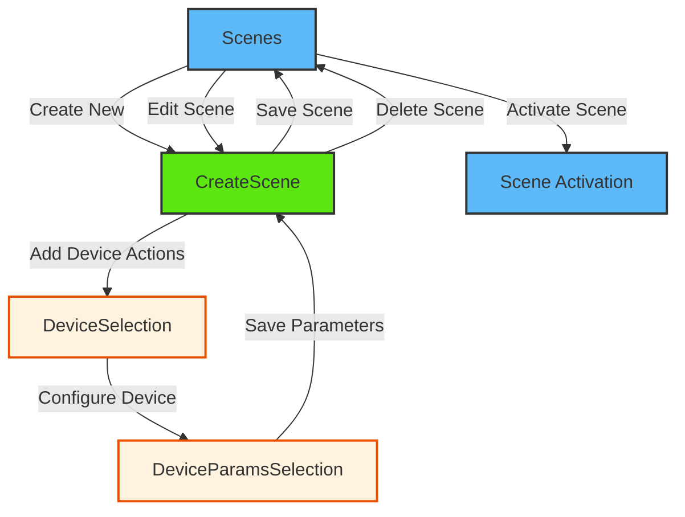

# Scene

<details>
<summary><strong>Overview</strong></summary>

The scene module provides comprehensive functionality for managing device scenes across multiple nodes in the ESP RainMaker system. It allows users to create, edit, trigger, and delete scenes that can control multiple devices simultaneously with a unified interface using the CDF (Central Data Framework) and SDK.

</details>

<details>
<summary><strong>Screens and Features</strong></summary>

### 1. Scenes Screen (`Scenes.tsx`)

- **Purpose**: Main screen for scene management and activation
- **Key Features**:
  - Lists all available scenes with real-time updates
  - Scene activation with loading states
  - Scene management: edit, delete, and favorite functionality
  - Pull-to-refresh scene synchronization
  - Empty state handling for no scenes
  - Navigation to scene creation and editing screens
- **CDF/SDK Functions**:

  ```typescript
  // Scene synchronization with CDF
  await store.nodeStore.syncNodeList();
  await store.sceneStore.syncScenesFromNodes();

  // Scene activation
  const selectedScene = sceneStore.scenesByID[sceneId];
  await selectedScene.activate();

  // Scene management
  await selectedScene.remove(); // Delete scene
  ```

- **CDF Documentation**: Scene operations are managed through CDF's SceneStore

### 2. Create Scene Screen (`CreateScene.tsx`)

- **Purpose**: Comprehensive scene creation, editing, and deletion screen
- **Key Features**:
  - Scene name input and validation
  - Device action display and management with real-time updates
  - Scene configuration using scene context
  - Dual-mode operation: create new scenes or edit existing ones
  - Scene deletion with confirmation
  - Navigation to DeviceSelection for adding device actions
  - Loading states for all operations
- **CDF/SDK Functions**:

  ```typescript
  // Create new scene
  const sceneData = {
    id: generateRandomId(),
    name: sceneName,
    config: state.actions,
    nodes: formattedNodes,
  };
  await sceneStore.createScene(sceneData);

  // Edit existing scene
  await sceneStore.scenesByID[state.sceneId]?.edit({
    sceneName: state.sceneName,
    config: state.actions,
    nodes: formattedNodes,
  });

  // Delete scene
  await sceneStore.scenesByID[state.sceneId]?.remove();
  ```

### 3. Device Selection Screen (`DeviceSelection.tsx`)

- **Purpose**: Device selection and management screen for scene configuration
- **Key Features**:
  - Lists all available devices from CDF nodes with scene support
  - Filters nodes that support `ESPRM_SCENES_SERVICE`
  - Real-time device connectivity status monitoring
  - Device selection state management with visual feedback
  - Maximum scene limit handling per device
  - Device action management (add/remove from scenes)
- **CDF/SDK Functions**:

  ```typescript
  // Get nodes from CDF store with MobX observation
  const nodeList = store?.nodeStore?.nodeList as ESPRMNode[];

  // Filter nodes with Scenes service support
  const sceneNodes = nodeList.filter((node) =>
    node.nodeConfig?.services?.some(
      (service) => service.type === ESPRM_SCENES_SERVICE
    )
  );

  // Extract devices with scene capabilities
  const devices = node.nodeConfig?.devices ?? [];
  ```

### 4. Device Parameters Selection Screen (`DeviceParamsSelection.tsx`)

- **Purpose**: Device parameter configuration and value setting screen for scene actions
- **Key Features**:
  - Lists selected device parameters with current values
  - Parameter value configuration with appropriate controls
  - Integrates with CDF parameter system and scene context
  - Modal-based parameter editing interface
  - Parameter filtering (excludes name and hidden parameters)
  - Real-time parameter value updates
- **CDF/SDK Functions**:

  ```typescript
  // Get device from CDF node store
  const node = store.nodeStore.nodesByID[nodeId];
  const device = node.nodeConfig.devices.find(
    (device) => device.name === deviceName
  );

  // Filter and process device parameters
  const filteredParams = device.params?.filter(
    (param) =>
      param.type !== ESPRM_NAME_PARAM_TYPE &&
      param.uiType !== ESPRM_UI_HIDDEN_PARAM_TYPE
  );

  // Map parameters with scene action values
  const params = filteredParams?.map((param) => ({
    ...param,
    value: getActionValue(nodeId, device.name, param.name) || param.value,
  }));
  ```

</details>

<details>
<summary><strong>Common CDF Patterns</strong></summary>

1. **Store Access Pattern**:

   ```typescript
   const { store } = useCDF();
   const { sceneStore, nodeStore } = store;
   ```

2. **Scene Data Synchronization**:

   ```typescript
   // Synchronize nodes and scenes from cloud
   await store.nodeStore.syncNodeList();
   await store.sceneStore.syncScenesFromNodes();

   // Access synchronized data
   const { sceneList, scenesByID } = sceneStore;
   const scene = scenesByID[sceneId];
   ```

3. **Error Handling Pattern**:

   ```typescript
   try {
     const result = await sceneOperation();
     if (result?.status === "success") {
       toast.showSuccess(t("scene.operationSuccess"));
     } else {
       toast.showError(result?.description || t("scene.operationFailed"));
     }
   } catch (error) {
     console.error("Scene operation error:", error);
     toast.showError(t("scene.operationFailed"));
   }
   ```

4. **Loading State Pattern**:

   ```typescript
   const [isLoading, setIsLoading] = useState(false);

   const handleSceneOperation = async () => {
     setIsLoading(true);
     try {
       await sceneOperation();
       // Handle success
     } catch (error) {
       // Handle error
     } finally {
       setIsLoading(false);
     }
   };
   ```

5. **MobX Observation Pattern**:

   ```typescript
   import { observer } from "mobx-react-lite";

   const Component = observer(() => {
     const { sceneList } = sceneStore;
     return <SceneList scenes={sceneList} />;
   });
   ```

</details>

## Scene Context (useScene Hook)

The `useScene` hook provides centralized state management for scene operations using React Context and useReducer pattern.

### State Management

```typescript
interface SceneState {
  forceUpdateUI: number; // Force UI re-renders
  sceneName: string; // Current scene name
  sceneId: string; // Current scene ID
  isEditing: boolean; // Edit mode flag
  prevActions: Record<string, any>; // Previous action state
  actions: Record<string, any>; // Current scene actions
  nodes: SceneNode[]; // Scene nodes configuration
  nodesRemoved: string[]; // Nodes removed from scene
  nodesAdded: Record<string, SceneNode>; // Newly added nodes
  nodesEdited: Record<string, SceneNode>; // Modified nodes
  selectedDevice: {
    // Currently selected device
    nodeId: string;
    deviceName: string;
    displayName: string;
  } | null;
}
```

### Context Provider Functions

#### Scene Information Management

```typescript
// Set scene basic information
setSceneInfo(name: string, id: string): void;

// Set scene name
setSceneName(name: string): void;

// Set editing mode
setEditingMode(isEditing: boolean): void;

// Reset entire state
resetState(): void;
```

#### Action Management

```typescript
// Check if action exists for device/parameter
checkActionExists(nodeId: string, device?: string, param?: string): {
  exist: boolean;
  value?: any
};

// Set action value for device parameter
setActionValue(nodeId: string, device: string, param: string, value: any): void;

// Delete specific action value
deleteActionValue(nodeId: string, device: string, param: string): void;

// Delete entire device action
deleteAction(nodeId: string, device: string): void;

// Get action value for device parameter
getActionValue(nodeId: string, device: string, param: string): any;
```

#### Device Operations

```typescript
// Set currently selected device
setSelectedDevice(device: {
  nodeId: string;
  deviceName: string;
  displayName: string
} | null): void;

// Check if device is disabled and why
checkDeviceDisabled(
  nodeId: string,
  deviceName: string | null,
  isConnected: boolean,
  hasReachedMax: boolean
): { isDisabled: boolean; reason?: "offline" | "max_reached" };
```

## Navigation Flow



The scene module flow consists of four main paths:

1. **Scene Management**: Scenes → (CreateScene/Edit)
2. **Scene Creation**: CreateScene → DeviceSelection → DeviceParamsSelection
3. **Scene Activation**: Direct activation from Scenes list
4. **Scene Configuration**: Device and parameter management within scenes

<details>
<summary><strong>CDF Documentation Links</strong></summary>

- **CDF SceneStore**: Manages all scene operations including create, edit, delete, and activate
- **CDF NodeStore**: Provides access to nodes and devices for scene configuration
- **Scene Context**: React Context-based state management for scene operations
- **MobX Integration**: Reactive updates for scene data changes through CDF stores
</details>
