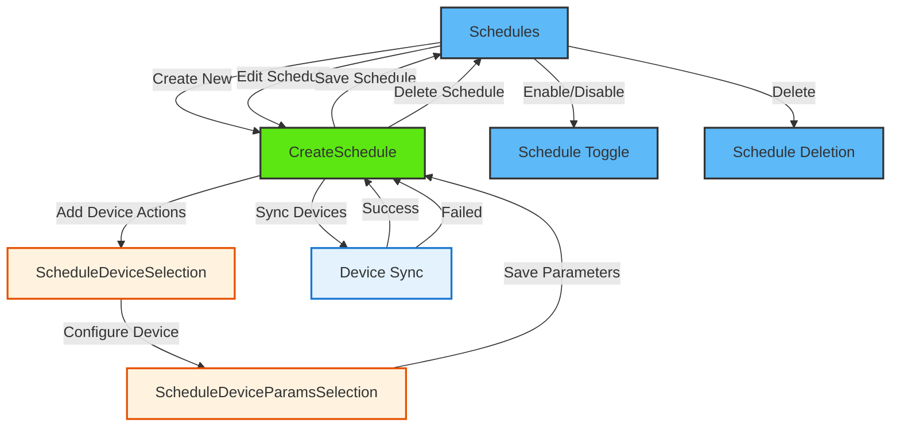

# Schedule

<details>
<summary><strong>Overview</strong></summary>

The schedule module provides comprehensive functionality for managing device schedules across multiple nodes in the ESP RainMaker system. It allows users to create, edit, enable, disable, and delete schedules that can control multiple devices automatically at specified times with repeat patterns using the CDF (Central Data Framework) and SDK.

</details>

## Navigation Flow



The schedule module flow consists of four main paths:

1. **Schedule Management**: Schedules → (CreateSchedule/Edit/Toggle/Delete)
2. **Schedule Creation**: CreateSchedule → ScheduleDeviceSelection → ScheduleDeviceParamsSelection
3. **Schedule Configuration**: Device and parameter management within schedules
4. **Device Synchronization**: Sync out-of-sync devices to ensure schedule accuracy

<details>
<summary><strong>Screens and Features</strong></summary>

### 1. Schedules Screen (`Schedules.tsx`)

- **Purpose**: Main screen for schedule management and control
- **Key Features**:
  - Lists all available schedules
  - Schedule enable/disable toggle with loading states
  - Schedule management: edit, delete functionality
  - Pull-to-refresh schedule synchronization
  - Empty state handling for no schedules
  - Navigation to schedule creation and editing screens
  - Edit mode for bulk operations
- **CDF/SDK Functions**:

  ```typescript
  // Schedule synchronization with CDF
  await nodeStore.syncNodeList();
  await scheduleStore.syncSchedulesFromNodes(currentHome.nodes || []);

  // Schedule operations
  await schedule.enable(); // Enable schedule
  await schedule.disable(); // Disable schedule
  await schedule.remove(); // Delete schedule
  ```

- **CDF Documentation**: Schedule operations are managed through CDF's ScheduleStore

### 2. Create Schedule Screen (`CreateSchedule.tsx`)

- **Purpose**: Comprehensive schedule creation, editing, and deletion screen
- **Key Features**:
  - Schedule name input and validation
  - Time picker with AM/PM format
  - Repeat days selection (Monday-Sunday)
  - Device action display and management with real-time updates
  - Schedule configuration using schedule context
  - Dual-mode operation: create new schedules or edit existing ones
  - Schedule deletion with confirmation
  - Navigation to DeviceSelection for adding device actions
  - Loading states for all operations
  - Sync functionality for out-of-sync devices
- **CDF/SDK Functions**:

  ```typescript
  // Create new schedule
  const scheduleData = {
    id: state.scheduleId,
    name: state.scheduleName,
    description: "",
    nodes: Object.keys(state.actions),
    action: state.actions || {},
    triggers: state.triggers,
    enabled: state.enabled,
    validity: state.validity,
    info: state.info,
    flags: state.flags,
  };
  await scheduleStore.createSchedule(scheduleData);

  // Edit existing schedule
  await scheduleStore.schedulesByID[state.scheduleId]?.edit({
    name: scheduleData.name,
    action: scheduleData.action,
    triggers: state.triggers,
  });

  // Delete schedule
  await scheduleStore.schedulesByID[state.scheduleId]?.remove();
  ```

### 3. Schedule Device Selection Screen (`ScheduleDeviceSelection.tsx`)

- **Purpose**: Device selection and management screen for schedule configuration
- **Key Features**:
  - Lists all available devices from CDF nodes with schedule support
  - Filters nodes that support `ESPRM_SCHEDULES_SERVICE`
  - Real-time device connectivity status monitoring
  - Device selection state management with visual feedback
  - Maximum schedule limit handling per device
  - Device action management (add/remove from schedules)
  - Out-of-sync device detection and display
- **CDF/SDK Functions**:

  ```typescript
  // Get nodes from CDF store with MobX observation
  const nodeList = store?.nodeStore?.nodeList as ESPRMNode[];

  // Filter nodes with Schedules service support
  const scheduleNodes = nodeList.filter((node) =>
    node.nodeConfig?.services?.some(
      (service) => service.type === ESPRM_SCHEDULES_SERVICE
    )
  );

  // Extract devices with schedule capabilities
  const devices = node.nodeConfig?.devices ?? [];
  ```

### 4. Schedule Device Parameters Selection Screen (`ScheduleDeviceParamsSelection.tsx`)

- **Purpose**: Device parameter configuration and value setting screen for schedule actions
- **Key Features**:
  - Lists selected device parameters with current values
  - Parameter value configuration with appropriate controls
  - Integrates with CDF parameter system and schedule context
  - Modal-based parameter editing interface
  - Parameter filtering (excludes name and hidden parameters)
  - Real-time parameter value updates
  - Save/delete parameter actions
- **CDF/SDK Functions**:

  ```typescript
  // Get device from CDF node store
  const node = store.nodeStore.nodesByID[nodeId];
  const device = node.nodeConfig.devices.find(
    (device) => device.name === deviceName
  );

  // Filter and process device parameters
  const filteredParams = device.params?.filter(
    (param) =>
      param.type !== ESPRM_NAME_PARAM_TYPE &&
      param.uiType !== ESPRM_UI_HIDDEN_PARAM_TYPE
  );

  // Map parameters with schedule action values
  const params = filteredParams?.map((param) => ({
    ...param,
    value: getActionValue(nodeId, device.name, param.name) || param.value,
  }));
  ```

</details>

<details>
<summary><strong>Common CDF Patterns</strong></summary>

1. **Store Access Pattern**:

   ```typescript
   const { store } = useCDF();
   const { scheduleStore, nodeStore } = store;
   ```

2. **Schedule Data Synchronization**:

   ```typescript
   // Synchronize nodes and schedules from cloud
   await store.nodeStore.syncNodeList();
   await store.scheduleStore.syncSchedulesFromNodes(currentHome.nodes || []);

   // Access synchronized data
   const { scheduleList, schedulesByID } = scheduleStore;
   const schedule = schedulesByID[scheduleId];
   ```

3. **Error Handling Pattern**:

   ```typescript
   try {
     const result = await scheduleOperation();
     if (result?.status === "success") {
       toast.showSuccess(t("schedule.operationSuccess"));
     } else {
       toast.showError(result?.description || t("schedule.operationFailed"));
     }
   } catch (error) {
     console.error("Schedule operation error:", error);
     toast.showError(t("schedule.operationFailed"));
   }
   ```

4. **Loading State Pattern**:

   ```typescript
   const [isLoading, setIsLoading] = useState(false);

   const handleScheduleOperation = async () => {
     setIsLoading(true);
     try {
       await scheduleOperation();
       // Handle success
     } catch (error) {
       // Handle error
     } finally {
       setIsLoading(false);
     }
   };
   ```

5. **MobX Observation Pattern**:

   ```typescript
   import { observer } from "mobx-react-lite";

   const Component = observer(() => {
     const { scheduleList } = scheduleStore;
     return <ScheduleList schedules={scheduleList} />;
   });
   ```

</details>

## Schedule Context (useSchedule Hook)

The `useSchedule` hook provides centralized state management for schedule operations using React Context and useReducer pattern.

### State Management

```typescript
interface ScheduleState {
  forceUpdateUI: number; // Force UI re-renders
  scheduleName: string; // Current schedule name
  scheduleId: string; // Current schedule ID
  isEditing: boolean; // Edit mode flag
  enabled: boolean; // Schedule enabled status
  triggers: ScheduleTrigger[]; // Schedule timing triggers
  prevActions: Record<string, any>; // Previous action state
  actions: Record<string, any>; // Current schedule actions
  nodes: ScheduleNode[]; // Schedule nodes configuration
  nodesRemoved: string[]; // Nodes removed from schedule
  nodesAdded: Record<string, ScheduleNode>; // Newly added nodes
  nodesEdited: Record<string, ScheduleNode>; // Modified nodes
  selectedDevice: {
    // Currently selected device
    nodeId: string;
    deviceName: string;
    displayName: string;
  } | null;
  validity: any; // Schedule validity settings
  info: any; // Schedule info
  flags: any; // Schedule flags
  outOfSyncMeta: Record<string, any>; // Out-of-sync device metadata
  isSyncing: boolean; // Sync operation status
}
```

### Context Provider Functions

#### Schedule Information Management

```typescript
// Set schedule basic information
setScheduleInfo(schedule: any): void;

// Set schedule name
setScheduleName(name: string): void;

// Set editing mode
setEditingMode(isEditing: boolean): void;

// Reset entire state
resetState(): void;
```

#### Action Management

```typescript
// Check if action exists for device/parameter
checkActionExists(nodeId: string, device?: string, param?: string): {
  exist: boolean;
  value?: any
};

// Set action value for device parameter
setActionValue(nodeId: string, device: string, param: string, value: any): void;

// Delete specific action value
deleteActionValue(nodeId: string, device: string, param: string): void;

// Delete entire device action
deleteAction(nodeId: string, device: string): void;

// Get action value for device parameter
getActionValue(nodeId: string, device: string, param: string): any;
```

#### Device Operations

```typescript
// Set currently selected device
setSelectedDevice(device: {
  nodeId: string;
  deviceName: string;
  displayName: string
} | null): void;

// Check if device is disabled and why
checkDeviceDisabled(
  nodeId: string,
  deviceName: string | null,
  isConnected: boolean,
  hasReachedMax: boolean
): { isDisabled: boolean; reason?: "offline" | "max_reached" };

// Check if node is out of sync
checkNodeOutOfSync(nodeId: string): {
  isOutOfSync: boolean;
  details?: {
    action: Record<string, any>;
    name: string;
    triggers: ScheduleTrigger[];
    flags: number;
  };
};
```

#### Schedule Operations

```typescript
// Create or update schedule
handleSaveSchedule(): Promise<boolean>;

// Delete schedule
handleDeleteSchedule(): Promise<boolean>;

// Sync out-of-sync devices
handleScheduleSync(): Promise<boolean>;

// Check for offline nodes
checkOfflineNodes(): boolean;
```

## Schedule Components

### ScheduleActionsHeader

- **Purpose**: Header component for schedule actions section
- **Features**:
  - Add device action button
  - Sync button for out-of-sync devices
  - Loading states for sync operations
  - Conditional rendering based on sync status

### ScheduleActions

- **Purpose**: Individual device action display component
- **Features**:
  - Device action visualization
  - Out-of-sync status indication
  - Action editing capabilities

### ScheduleCard

- **Purpose**: Schedule list item component
- **Features**:
  - Schedule information display (name, time, repeat days)
  - Enable/disable toggle
  - Edit/delete actions
  - Device count display
  - Loading states for operations

### ScheduleTime

- **Purpose**: Time selection component
- **Features**:
  - Time display with AM/PM format
  - Time picker modal integration
  - Current time initialization

### ScheduleDays

- **Purpose**: Repeat days selection component
- **Features**:
  - Day selection buttons (S, M, T, W, Th, F, S)
  - Visual selection states
  - Day toggle functionality

## Schedule Data Structure

### Schedule Trigger Format

```typescript
interface ScheduleTrigger {
  m: number; // Minutes from midnight (0-1439)
  d: number; // Day bitmap (bit 0 = Sunday, bit 1 = Monday, etc.)
}
```

### Schedule Action Format

```typescript
interface ScheduleAction {
  [nodeId: string]: {
    [deviceName: string]: {
      [paramName: string]: any; // Parameter value
    };
  };
}
```

### Out-of-Sync Detection

The schedule module includes sophisticated out-of-sync detection:

- **Detection**: Compares current device state with stored schedule actions
- **Visual Indication**: Shows "Out of sync" status on affected devices
- **Metadata Storage**: Tracks out-of-sync information in `outOfSyncMeta` state

<details>
<summary><strong>CDF Documentation Links</strong></summary>

- **CDF ScheduleStore**: Manages all schedule operations including create, edit, delete, enable, and disable
- **CDF NodeStore**: Provides access to nodes and devices for schedule configuration
- **Schedule Context**: React Context-based state management for schedule operations
- **MobX Integration**: Reactive updates for schedule data changes through CDF stores
</details>
