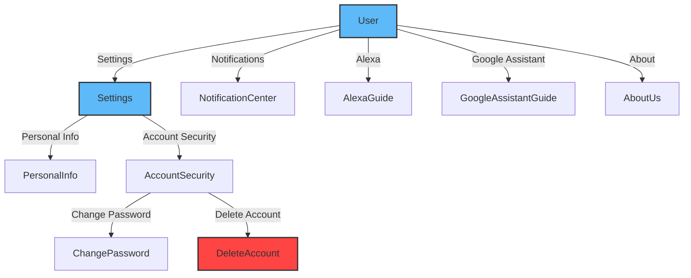

# User

<details>
<summary><strong>Overview</strong></summary>

The user module manages user profile, settings, third-party integrations, notifications, and account management features. It uses the CDF (Central Data Framework) and SDK for handling user operations.

</details>

<details>
<summary><strong>Screens and Features</strong></summary>

### 1. User Screen (`User.tsx`)

- **Purpose**: Main user profile dashboard showing user info and options
- **Key Features**:
  - User profile information display
  - Third-party integrations (Alexa, Google Assistant)
  - Quick access to notifications
  - Settings management
  - Debug mode (Development only)
  - Logout functionality
- **CDF/SDK Functions**:

  ```typescript
  // Get user info
  const userInfo = store.userStore.userInfo;

  // Handle logout
  await store.userStore.user?.logout();
  ```

- **SDK Documentation**: [ESPRMUser](https://espressif.github.io/esp-rainmaker-app-sdk-ts/classes/ESPRMUser.ESPRMUser.html)

### 2. Settings Screen (`Settings.tsx`)

- **Purpose**: Main settings configuration screen
- **Key Features**:
  - Personal information settings
  - Account security settings
  - About section
  - Gateway toggle
  - Dynamic settings items from config
- **CDF/SDK Functions**:
  ```typescript
  // Get gateway status
  const gatewayStatus = store.nodeGatewayStatus;
  ```

### 3. Personal Info Screen (`PersonalInfo.tsx`)

- **Purpose**: Manage user's personal information
- **Key Features**:
  - View/edit username/nickname
  - Real-time validation
  - Error handling with toast messages
  - Loading states
- **CDF/SDK Functions**:
  ```typescript
  // Update user name
  await store.userStore.user?.updateName(nickName);
  ```
- **SDK Documentation**: [ESPRMUser.updateName](https://espressif.github.io/esp-rainmaker-app-sdk-ts/classes/ESPRMUser.ESPRMUser.html#updatename)

### 4. Account Security Screen (`AccountSecurity.tsx`)

- **Purpose**: Manage account security settings
- **Key Features**:
  - Password change option
  - Account deletion
  - Third-party login handling
  - Conditional rendering based on login type
- **Navigation Flow**:
  - Links to ChangePassword and DeleteAccount screens

### 5. Delete Account Screen (`DeleteAccount.tsx`)

- **Purpose**: Handle account deletion process
- **Key Features**:
  - Two-step verification
  - Verification code input
  - Countdown timer for resend
  - Error handling
- **CDF/SDK Functions**:

  ```typescript
  // Request account deletion
  await store.userStore.user?.requestAccountDeletion();

  // Confirm account deletion
  await store.userStore.user?.confirmAccountDeletion(code);
  ```

- **SDK Documentation**: [ESPRMUser.requestAccountDeletion](https://espressif.github.io/esp-rainmaker-app-sdk-ts/classes/ESPRMUser.ESPRMUser.html#requestaccountdeletion)

### 6. Notification Center Screen (`NotificationCenter.tsx`)

- **Purpose**: Display and manage device/group sharing invitations
- **Key Features**:
  - List sharing invitations
  - Accept/decline functionality
  - Loading states
  - Empty state handling
  - Timestamp formatting
- **CDF/SDK Functions**:
  ```typescript
  // Get sharing list
  const sharingList = store.sharingList;
  ```

### 7. About Us Screen (`AboutUs.tsx`)

- **Purpose**: Display app information
- **Key Features**:
  - App version display
  - Website link
  - Logo display
  - External link handling

### 8. Integration Guide Screens (`AlexaGuide.tsx`, `GoogleAssistantGuide.tsx`)

- **Purpose**: Step-by-step integration guides
- **Key Features**:

  - Interactive image carousel
  - Step indicators
  - Image preview modal
  - Localized instructions
  - Responsive layout

  </details>

<details>
<summary><strong>Common CDF Patterns</strong></summary>

1. **User Store Access Pattern**:

   ```typescript
   const { store } = useCDF();
   const { userStore } = store;
   ```

2. **User Info Access Pattern**:

   ```typescript
   const userInfo = store.userStore.userInfo;
   const { name, email } = userInfo;
   ```

3. **Error Handling Pattern**:

   ```typescript
   try {
     const result = await operation();
     if (result.status === "success") {
       toast.showSuccess(successMessage);
     } else {
       toast.showError(result.description);
     }
   } catch (error) {
     toast.showError(error.description);
   }
   ```

4. **Loading State Pattern**:
   ```typescript
   setIsLoading(true);
   try {
     await operation();
     // Handle success
   } catch (error) {
     // Handle error
   } finally {
     setIsLoading(false);
   }
   ```
   </details>

## Navigation Flow



The user module flow consists of four main paths:

1. **Settings Management**: User → Settings → (PersonalInfo/AccountSecurity)
2. **Account Security**: AccountSecurity → (ChangePassword/DeleteAccount)
3. **Notifications**: User → NotificationCenter
4. **Integrations**: User → (AlexaGuide/GoogleAssistantGuide)

<details>
<summary><strong>SDK Documentation Links</strong></summary>

- [ESPRMUser Documentation](https://espressif.github.io/esp-rainmaker-app-sdk-ts/classes/ESPRMUser.ESPRMUser.html)
- [ESPRMUser.updateName](https://espressif.github.io/esp-rainmaker-app-sdk-ts/classes/ESPRMUser.ESPRMUser.html#updatename)
- [ESPRMUser.requestAccountDeletion](https://espressif.github.io/esp-rainmaker-app-sdk-ts/classes/ESPRMUser.ESPRMUser.html#requestaccountdeletion)
</details>
