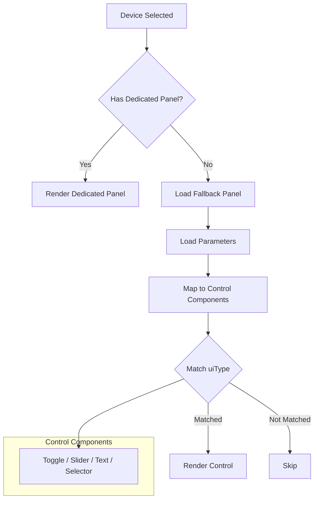

# Parameter Controls

This directory contains a collection of UI components for controlling various device parameters in the ESP RainMaker Home app. Each component is designed to handle specific parameter types and provide appropriate user interfaces.

<details>
<summary><strong>Component Structure</strong></summary>

All parameter control components follow a consistent structure:

```typescript
interface ParamControlProps {
  param: ESPRMDeviceParam;  // The device parameter to control
  disabled?: boolean;       // Optional disabled state
}
```
</details>

<details>
<summary><strong>Supported Parameter Types</strong></summary>

### Text Controls

1. **DefaultText** (`esp.ui.text`)
   - Basic text input for any data type
   - Handles general text display and editing

2. **TextInput** (`esp.ui.text-input`)
   - Enhanced text input with modal editing
   - Supports character limits via `bounds.maxLength`

### Toggle Controls

1. **ToggleSwitch** (`esp.ui.toggle`)
   - Simple ON/OFF toggle switch
   - Data type: `bool`

2. **PowerButton** (`esp.ui.power`)
   - Large circular power button
   - Data type: `bool`
   - Visual feedback for state changes

3. **PushButton** (`esp.ui.push-btn-big`)
   - Large push button with state display
   - Data type: `bool`
   - Momentary action button

4. **TriggerButton** (`esp.ui.trigger`)
   - Press-and-hold action button
   - Data type: `bool`
   - Platform: Android only

5. **DeviceLightBulb** (`esp.ui.light-bulb`)
   - Light bulb icon with ON/OFF state
   - Data type: `bool`
   - Visual feedback with icon changes

### Slider Controls

1. **Slider** (`esp.ui.slider`)
   - Basic slider for numeric values
   - Data types: `int`, `float`
   - Requires `bounds` (min, max)

2. **BrightnessSlider** (`esp.param.brightness`)
   - Specialized slider for brightness control
   - Data type: `int`
   - Range: 0-100%

3. **ColorTemperatureSlider** (`esp.param.temperature`, `esp.param.cct`)
   - Controls color temperature in Kelvin
   - Data type: `int`
   - Gradient visualization

4. **HueSlider** (`esp.ui.hue-slider`)
   - Linear hue selection
   - Data type: `int`
   - Range: 0-360°

5. **HueCircle** (`esp.ui.hue-circle`)
   - Circular color wheel for hue selection
   - Data type: `int`
   - Range: 0-360°

6. **SaturationSlider** (`esp.param.saturation`)
   - Controls color saturation
   - Data type: `int`
   - Range: 0-100%

7. **SpeedSlider** (`esp.param.speed`)
   - Controls device speed
   - Data type: `int`
   - Multi-color gradient feedback

8. **TemperatureSlider** (`esp.param.temperature`)
   - Controls temperature settings
   - Data type: `int`
   - Cold-to-hot gradient visualization

9. **VolumeSlider** (`esp.param.volume`)
   - Controls volume levels
   - Data type: `int`
   - Range: 0-100%

### Selector Controls

1. **DropdownSelector** (`esp.ui.dropdown`)
   - Selection from predefined options
   - Data types: `int`, `string`
   - Requires `bounds` or `validStrings`
</details>

<details>
<summary><strong>Adding New Parameter Controls</strong></summary>

To add support for a new parameter UI type:

1. Create a new component file in `param_controls/`:

```typescript
// NewControl.tsx
import React from 'react';
import { ParamControlProps } from './lib/types';
import { paramControlStyles as styles } from './lib/styles';

const NewControl: React.FC<ParamControlProps> = ({
  param,
  disabled = false,
}) => {
  // Component implementation
};

export default NewControl;
```

2. Add the component configuration in `config.tsx`:

```typescript
export const PARAM_CONTROLS = [
  // ... existing controls ...
  {
    name: "New Control",
    types: ["esp.ui.new-control-type"],  // UI type identifier
    control: NewControl,                  // Component reference
    dataTypes: ["int", "bool"],          // Supported data types
    requirements: "bounds (min, max)",    // Optional requirements
    platformRestriction: "android",       // Optional platform restriction
  }
];
```

3. Export the component in `index.ts`:

```typescript
export { default as NewControl } from './NewControl';
```

### Important Considerations

1. **UI Type Matching**:
   - The `types` field in config must match the `uiType` field in device parameters
   - Multiple UI types can map to the same control

2. **Data Type Support**:
   - Specify supported data types in the config
   - Handle type conversion in the component

3. **Styling**:
   - Use the shared styles from `lib/styles.ts`
   - Follow the existing component structure

4. **State Management**:
   - Use local state for immediate feedback
   - Sync with device parameter values
   - Implement proper disabled state handling

5. **Documentation**:
   - Add JSDoc comments to your component
   - Update this README with new control details
</details>

<details>
<summary><strong>Common Utilities</strong></summary>

The `lib` directory provides shared utilities:

- `types.ts`: Common types and helper functions
- `styles.ts`: Shared styles for consistent appearance
</details>

## Parameter Rendering Flow



This dynamic rendering system allows the app to:
- Handle any device type, even without a dedicated UI
- Support new parameter types by adding entries to `PARAM_CONTROLS`
- Maintain consistent UI patterns across different device types
- Gracefully handle unknown parameter types


